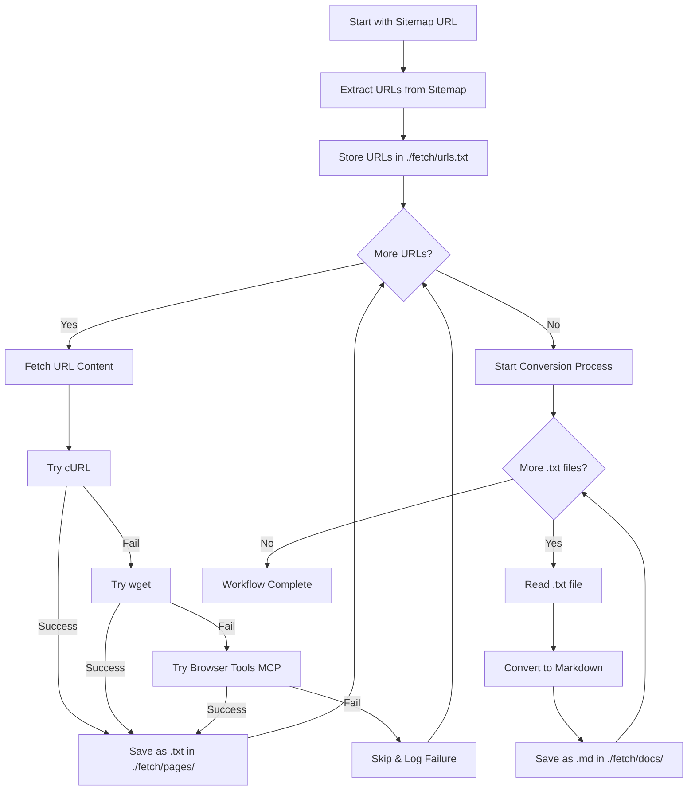

# Documentation Fetching Workflow

I am Cline, tasked with systematically extracting and organizing documentation from websites using their sitemaps. This workflow ensures comprehensive documentation collection with robust error handling and organized storage.

## Workflow Overview

This process transforms a sitemap URL into a complete local documentation repository through automated fetching and conversion.

```
Sitemap URL → Extract URLs → Fetch Content → Convert to Markdown → Organized Docs
```

## Directory Structure

```
./fetch/
├── urls.txt              # Extracted URLs from sitemap
├── pages/               # Raw fetched content
│   ├── page1.txt
│   ├── page2.txt
│   └── ...
└── docs/                # Converted markdown files
    ├── page1.md
    ├── page2.md
    └── ...
```

## Core Workflow



## Implementation Steps

### Phase 1: Setup and URL Extraction

1. **Initialize Directories**
   ```bash
   mkdir -p ./fetch/pages
   mkdir -p ./fetch/docs
   ```

2. **Extract URLs from Sitemap**
   - Parse the XML sitemap
   - Extract all `<loc>` elements
   - Clean and validate URLs
   - Write to `./fetch/urls.txt` (one URL per line)

### Phase 2: Content Fetching

**For each URL in urls.txt:**

1. **Generate filename**: Convert URL to safe filename
   - `https://dspy.ai/cheatsheet` → `https://dspy.ai/cheatsheet.txt`
   - Replace invalid filesystem characters

2. **Attempt fetch with fallback chain**:
   - **Primary**: `curl -L -o ./fetch/pages/filename.txt URL`
   - **Secondary**: `wget -O ./fetch/pages/filename.txt URL`
   - **Tertiary**: Browser Tools MCP for dynamic content
   - **Failure**: Log error and continue

3. **Error Handling**:
   - Log failed URLs with reason
   - Continue with next URL
   - Maintain failure count

### Phase 3: Content Conversion

**For each .txt file in ./fetch/pages/:**

1. **Read content** from `.txt` file
2. **Clean and format**:
   - Remove HTML artifacts if present
   - Preserve structure and formatting
   - Add metadata header (original URL, fetch date)
3. **Convert filename**: `.txt` → `.md`
4. **Save** to `./fetch/docs/`

## File Naming Convention

- **URL**: `https://dspy.ai/cheatsheet`
- **Raw file**: `./fetch/pages/https://dspy.ai/cheatsheet.txt`
- **Markdown file**: `./fetch/docs/https://dspy.ai/cheatsheet.md`

For complex URLs with parameters:
- Replace `/` with `_`
- Replace `?` with `_`
- Replace `&` with `_`
- Limit filename length to 255 characters

## Error Handling Strategy

### Fetch Failures
- **Network errors**: Retry once after 5-second delay
- **404 errors**: Log and skip
- **Timeout errors**: Try next method in chain
- **Permission errors**: Log and skip

### Content Processing
- **Empty files**: Delete and log
- **Binary content**: Skip conversion, log warning
- **Encoding issues**: Attempt UTF-8 conversion, fallback to Latin-1

## Progress Tracking

Maintain progress indicators:
- URLs extracted: `X/Total`
- Pages fetched: `X/Total (Y failed)`
- Docs converted: `X/Total`
- Completion percentage

## Quality Assurance

### Validation Checks
- Verify all directories exist before processing
- Confirm sitemap XML is valid before extraction
- Validate URLs before fetching
- Check file integrity after saving

### Cleanup
- Remove empty files
- Log summary statistics
- Archive failed URLs for manual review

## Usage Example

```bash
# Input
sitemap_url = "https://dspy.ai/sitemap.xml"

# Expected Output Structure
./fetch/
├── urls.txt                           # 50 URLs extracted
├── pages/                            
│   ├── https://dspy.ai/index.txt      # Raw HTML/content
│   ├── https://dspy.ai/cheatsheet.txt
│   └── ... (48 more files)
└── docs/
    ├── https://dspy.ai/index.md       # Clean markdown
    ├── https://dspy.ai/cheatsheet.md
    └── ... (converted documentation)
```

## Success Metrics

- **Coverage**: Percentage of URLs successfully fetched
- **Quality**: Readability of converted markdown
- **Completeness**: All non-error URLs converted
- **Speed**: Average time per URL processing

## Recovery and Resume

The workflow supports interruption and resume:
- Check existing files before fetching
- Skip already-processed URLs
- Resume from last successful position
- Maintain state in progress files

REMEMBER: This workflow prioritizes completeness and resilience. Failed individual URLs should not stop the entire process. The goal is maximum documentation capture with graceful degradation for problematic content.

## POML Implementation

Below is the complete workflow implementation in Microsoft POML (Prompt Orchestration Markup Language) format:

```poml
<poml>
  <meta>
    <title>Documentation Fetching Workflow</title>
    <version>1.0</version>
    <author>Cline</author>
    <description>Automated sitemap-to-documentation extraction workflow</description>
  </meta>

  <role>
    I am Cline, an expert software engineer specializing in automated documentation extraction and organization. I systematically process sitemaps to create comprehensive local documentation repositories with robust error handling.
  </role>

  <task>
    Execute a complete documentation fetching workflow that:
    1. Extracts URLs from a provided sitemap XML
    2. Fetches content using a multi-tier fallback system
    3. Converts raw content to organized markdown documentation
    4. Maintains comprehensive error handling and progress tracking
  </task>

  <input>
    <variable name="sitemap_url" type="string" required="true">
      The XML sitemap URL to process (e.g., https://dspy.ai/sitemap.xml)
    </variable>
    <variable name="max_retries" type="number" default="3">
      Maximum retry attempts per URL
    </variable>
    <variable name="timeout" type="number" default="30">
      Request timeout in seconds
    </variable>
  </input>

  <workflow>
    <step id="setup" name="Initialize Environment">
      <task>
        Create directory structure and initialize tracking files
      </task>
      <commands>
        <command>mkdir -p ./fetch/pages</command>
        <command>mkdir -p ./fetch/docs</command>
        <command>touch ./fetch/urls.txt</command>
        <command>touch ./fetch/errors.log</command>
        <command>touch ./fetch/progress.log</command>
      </commands>
      <validation>
        Verify all directories exist and are writable
      </validation>
    </step>

    <step id="extract" name="Extract URLs from Sitemap">
      <task>
        Parse XML sitemap and extract all valid URLs
      </task>
      <logic>
        <if condition="sitemap_url.endsWith('.xml')">
          <action>Parse XML and extract &lt;loc&gt; elements</action>
        </if>
        <else>
          <action>Log error: Invalid sitemap format</action>
          <action>Exit workflow</action>
        </else>
      </logic>
      <output>
        Write extracted URLs to ./fetch/urls.txt (one per line)
      </output>
      <validation>
        Ensure at least one valid URL was extracted
      </validation>
    </step>

    <step id="fetch" name="Fetch Content">
      <task>
        For each URL, attempt content fetching with fallback methods
      </task>
      <loop>
        <for-each item="url" in="urls.txt">
          <variable name="filename" value="{{url | sanitize_filename}}.txt"/>
          <variable name="filepath" value="./fetch/pages/{{filename}}"/>
          
          <try-sequence>
            <method name="curl" priority="1">
              <command>curl -L -s --max-time {{timeout}} -o "{{filepath}}" "{{url}}"</command>
              <success-condition>File exists and size > 0</success-condition>
            </method>
            
            <method name="wget" priority="2">
              <command>wget -q --timeout={{timeout}} -O "{{filepath}}" "{{url}}"</command>
              <success-condition>File exists and size > 0</success-condition>
            </method>
            
            <method name="browser-tools" priority="3">
              <action>Use MCP browser tools to fetch dynamic content</action>
              <success-condition>Content retrieved and saved</success-condition>
            </method>
          </try-sequence>

          <on-success>
            <log level="info">Successfully fetched: {{url}}</log>
            <increment counter="success_count"/>
          </on-success>

          <on-failure>
            <log level="error">Failed to fetch: {{url}}</log>
            <append file="./fetch/errors.log">{{url}} - All methods failed</append>
            <increment counter="error_count"/>
          </on-failure>

          <progress>
            <log>Progress: {{loop_index}}/{{total_urls}} ({{success_count}} success, {{error_count}} errors)</log>
          </progress>
        </for-each>
      </loop>
    </step>

    <step id="convert" name="Convert to Markdown">
      <task>
        Transform raw content files into structured markdown documentation
      </task>
      <loop>
        <for-each item="txt_file" in="./fetch/pages/*.txt">
          <variable name="content" value="{{read_file(txt_file)}}"/>
          <variable name="original_url" value="{{txt_file | extract_url}}"/>
          <variable name="md_filename" value="{{txt_file | replace('.txt', '.md') | basename}}"/>
          <variable name="md_filepath" value="./fetch/docs/{{md_filename}}"/>

          <process>
            <clean-content>
              <remove-html-artifacts/>
              <preserve-structure/>
              <normalize-whitespace/>
            </clean-content>
            
            <add-metadata>
              <header>
                # {{original_url | extract_title}}
                
                **Source:** {{original_url}}  
                **Fetched:** {{current_timestamp}}  
                **Status:** {{fetch_status}}
                
                ---
                
              </header>
            </add-metadata>
            
            <format-content>
              <convert-to-markdown>{{content}}</convert-to-markdown>
            </format-content>
          </process>

          <output>
            <write file="{{md_filepath}}">{{formatted_content}}</write>
          </output>

          <validation>
            <check condition="file_exists(md_filepath)">
              <log level="info">Converted: {{original_url}} → {{md_filename}}</log>
              <increment counter="converted_count"/>
            </check>
            <else>
              <log level="error">Failed to convert: {{txt_file}}</log>
              <increment counter="conversion_errors"/>
            </else>
          </validation>
        </for-each>
      </loop>
    </step>

    <step id="cleanup" name="Cleanup and Reporting">
      <task>
        Clean up temporary files and generate completion report
      </task>
      <actions>
        <remove-empty-files dir="./fetch/pages/"/>
        <remove-empty-files dir="./fetch/docs/"/>
        <generate-summary-report/>
      </actions>
      
      <report>
        <summary>
          ## Documentation Fetching Complete
          
          **Sitemap:** {{sitemap_url}}  
          **Total URLs:** {{total_urls}}  
          **Successfully Fetched:** {{success_count}}  
          **Conversion Success:** {{converted_count}}  
          **Errors:** {{error_count + conversion_errors}}
          
          **Success Rate:** {{(success_count / total_urls * 100) | round(2)}}%  
          **Conversion Rate:** {{(converted_count / success_count * 100) | round(2)}}%
          
          ### Files Generated:
          - Raw content: ./fetch/pages/ ({{success_count}} files)
          - Markdown docs: ./fetch/docs/ ({{converted_count}} files)
          - Error log: ./fetch/errors.log
          - URL list: ./fetch/urls.txt
        </summary>
      </report>
    </step>
  </workflow>

  <error-handling>
    <global-handlers>
      <on-network-error>
        <retry max-attempts="{{max_retries}}" delay="5s"/>
        <log-error with-details="true"/>
      </on-network-error>
      
      <on-file-system-error>
        <check-permissions/>
        <create-missing-directories/>
        <log-error with-details="true"/>
      </on-file-system-error>
      
      <on-parsing-error>
        <skip-item/>
        <log-error message="Parsing failed for {{current_url}}"/>
        <continue-workflow/>
      </on-parsing-error>
    </global-handlers>

    <recovery-strategies>
      <strategy name="partial-failure">
        Continue processing remaining items when individual items fail
      </strategy>
      
      <strategy name="checkpoint-resume">
        Save progress state to allow resuming interrupted workflows
      </strategy>
      
      <strategy name="graceful-degradation">
        Prefer partial success over complete failure
      </strategy>
    </recovery-strategies>
  </error-handling>

  <functions>
    <function name="sanitize_filename">
      <description>Convert URL to safe filesystem filename</description>
      <implementation>
        Replace invalid characters: / → _, ? → _, & → _, : → _
        Limit length to 200 characters
        Preserve domain and path structure
      </implementation>
    </function>

    <function name="extract_url">
      <description>Extract original URL from filename</description>
      <implementation>
        Reverse sanitization process
        Reconstruct original URL format
      </implementation>
    </function>

    <function name="extract_title">
      <description>Extract meaningful title from URL</description>
      <implementation>
        Use last path segment as title
        Convert hyphens to spaces
        Capitalize words appropriately
      </implementation>
    </function>
  </functions>

  <validation>
    <pre-execution>
      <check name="sitemap_accessibility">
        Verify sitemap URL is accessible and returns valid XML
      </check>
      <check name="tools_availability">
        Ensure curl, wget, and browser tools are available
      </check>
      <check name="directory_permissions">
        Verify write permissions for target directories
      </check>
    </pre-execution>

    <post-execution>
      <check name="completion_verification">
        Verify expected number of files were created
      </check>
      <check name="content_quality">
        Sample check converted markdown for quality
      </check>
      <check name="error_rate">
        Ensure error rate is within acceptable limits (&lt; 20%)
      </check>
    </post-execution>
  </validation>

  <examples>
    <example name="basic-usage">
      <input>
        <variable name="sitemap_url">https://dspy.ai/sitemap.xml</variable>
      </input>
      <expected-output>
        Directory structure with extracted URLs, raw pages, and converted markdown files
      </expected-output>
    </example>

    <example name="large-site">
      <input>
        <variable name="sitemap_url">https://docs.example.com/sitemap.xml</variable>
        <variable name="timeout">60</variable>
      </input>
      <expected-behavior>
        Handle large number of URLs with appropriate progress reporting
      </expected-behavior>
    </example>
  </examples>
</poml>
```

This POML implementation provides:

- **Structured workflow** with XML-like syntax using semantic components like `<role>`, `<task>`, and `<step>`
- **Template variables** for dynamic configuration
- **Comprehensive error handling** with multiple fallback strategies  
- **Progress tracking** and validation at each step
- **Reusable functions** for common operations
- **Complete workflow orchestration** from sitemap to documentation

The POML format makes the workflow more maintainable, testable, and suitable for integration with AI orchestration systems.