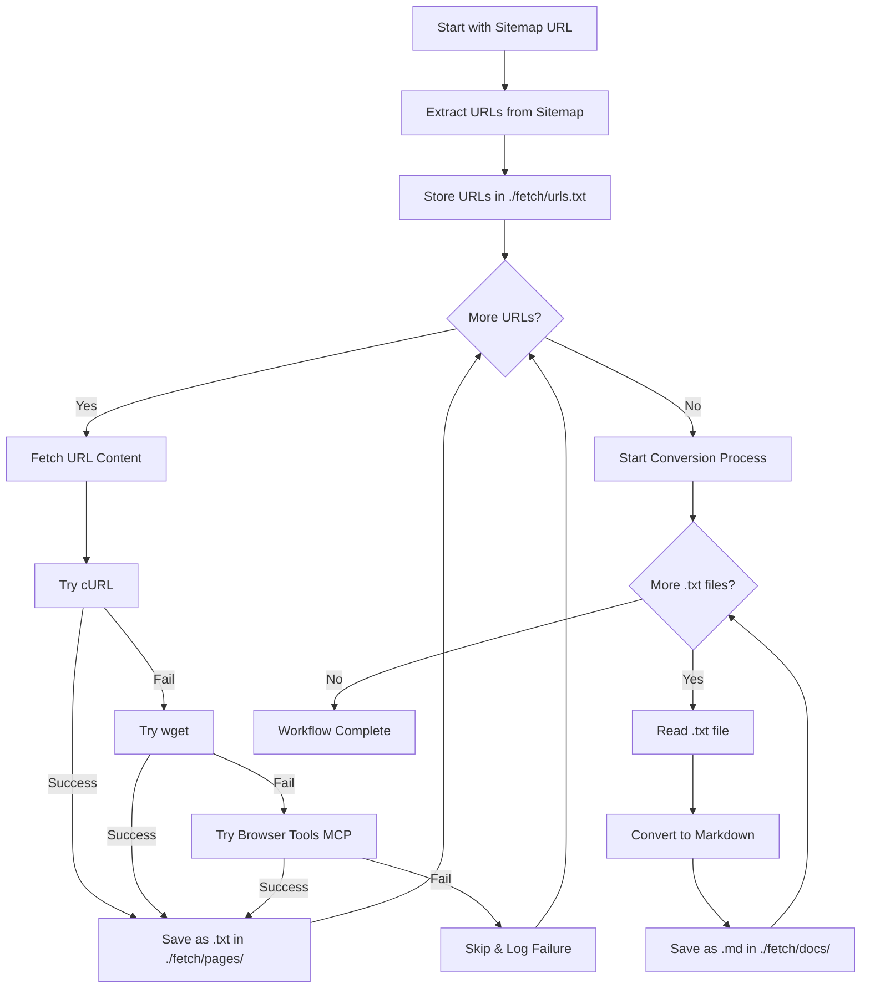

# Documentation Fetching Workflow

I am Cline, tasked with systematically extracting and organizing documentation from websites using their sitemaps. This workflow ensures comprehensive documentation collection with robust error handling and organized storage.

## Workflow Overview

This process transforms a sitemap URL into a complete local documentation repository through automated fetching and conversion.

```
Sitemap URL → Extract URLs → Fetch Content → Convert to Markdown → Organized Docs
```

## Directory Structure

```
./fetch/
├── urls.txt              # Extracted URLs from sitemap
├── pages/               # Raw fetched content
│   ├── page1.txt
│   ├── page2.txt
│   └── ...
└── docs/                # Converted markdown files
    ├── page1.md
    ├── page2.md
    └── ...
```

## Core Workflow



## Implementation Steps

### Phase 1: Setup and URL Extraction

1. **Initialize Directories**
   ```bash
   mkdir -p ./fetch/pages
   mkdir -p ./fetch/docs
   ```

2. **Extract URLs from Sitemap**
   - Parse the XML sitemap
   - Extract all `<loc>` elements
   - Clean and validate URLs
   - Write to `./fetch/urls.txt` (one URL per line)

### Phase 2: Content Fetching

**For each URL in urls.txt:**

1. **Generate filename**: Convert URL to safe filename
   - `https://dspy.ai/cheatsheet` → `https://dspy.ai/cheatsheet.txt`
   - Replace invalid filesystem characters

2. **Attempt fetch with fallback chain**:
   - **Primary**: `curl -L -o ./fetch/pages/filename.txt URL`
   - **Secondary**: `wget -O ./fetch/pages/filename.txt URL`
   - **Tertiary**: Browser Tools MCP for dynamic content
   - **Failure**: Log error and continue

3. **Error Handling**:
   - Log failed URLs with reason
   - Continue with next URL
   - Maintain failure count

### Phase 3: Content Conversion

**For each .txt file in ./fetch/pages/:**

1. **Read content** from `.txt` file
2. **Clean and format**:
   - Remove HTML artifacts if present
   - Preserve structure and formatting
   - Add metadata header (original URL, fetch date)
3. **Convert filename**: `.txt` → `.md`
4. **Save** to `./fetch/docs/`

## File Naming Convention

- **URL**: `https://dspy.ai/cheatsheet`
- **Raw file**: `./fetch/pages/https://dspy.ai/cheatsheet.txt`
- **Markdown file**: `./fetch/docs/https://dspy.ai/cheatsheet.md`

For complex URLs with parameters:
- Replace `/` with `_`
- Replace `?` with `_`
- Replace `&` with `_`
- Limit filename length to 255 characters

## Error Handling Strategy

### Fetch Failures
- **Network errors**: Retry once after 5-second delay
- **404 errors**: Log and skip
- **Timeout errors**: Try next method in chain
- **Permission errors**: Log and skip

### Content Processing
- **Empty files**: Delete and log
- **Binary content**: Skip conversion, log warning
- **Encoding issues**: Attempt UTF-8 conversion, fallback to Latin-1

## Progress Tracking

Maintain progress indicators:
- URLs extracted: `X/Total`
- Pages fetched: `X/Total (Y failed)`
- Docs converted: `X/Total`
- Completion percentage

## Quality Assurance

### Validation Checks
- Verify all directories exist before processing
- Confirm sitemap XML is valid before extraction
- Validate URLs before fetching
- Check file integrity after saving

### Cleanup
- Remove empty files
- Log summary statistics
- Archive failed URLs for manual review

## Usage Example

```bash
# Input
sitemap_url = "https://dspy.ai/sitemap.xml"

# Expected Output Structure
./fetch/
├── urls.txt                           # 50 URLs extracted
├── pages/                            
│   ├── https://dspy.ai/index.txt      # Raw HTML/content
│   ├── https://dspy.ai/cheatsheet.txt
│   └── ... (48 more files)
└── docs/
    ├── https://dspy.ai/index.md       # Clean markdown
    ├── https://dspy.ai/cheatsheet.md
    └── ... (converted documentation)
```

## Success Metrics

- **Coverage**: Percentage of URLs successfully fetched
- **Quality**: Readability of converted markdown
- **Completeness**: All non-error URLs converted
- **Speed**: Average time per URL processing

## Recovery and Resume

The workflow supports interruption and resume:
- Check existing files before fetching
- Skip already-processed URLs
- Resume from last successful position
- Maintain state in progress files

REMEMBER: This workflow prioritizes completeness and resilience. Failed individual URLs should not stop the entire process. The goal is maximum documentation capture with graceful degradation for problematic content.