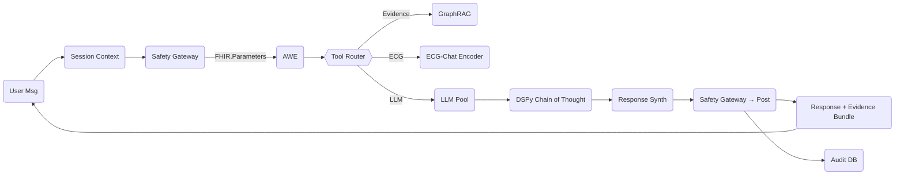

# Fairdoc AI Triage System

## 0. Executive Take-aways

1. Hard-coded safety heuristics and single-LLM dependency are replaced with a **layered, standards-aligned control plane** that enforces FHIR, NICE and DSPy guardrails.  
2. Reasoning, retrieval, and multimodal perception are **separated into deterministic micro-services** orchestrated by an Agentic Workflow Engine (AWE)––enabling plug-and-play LLMs, transparent versioning, and auditable outputs.  
3. Every medical answer now carries an **evidence bundle** (FHIR Parameters + provenance graph) linking the user query → retrieved knowledge → reasoning chain → final utterance; this supports clinician review, regulator audits, and continuous fine-tuning.  

## 1. High-Level Component Map  

| Layer | Component | Key Standards | Tech Choice | Purpose |
|-------|-----------|---------------|-------------|---------|
| **Edge** | Raven-Chat, WhatsApp, Web | FHIR SMART scopes | FastAPI, Twilio | Omni-channel intake/output |
| **Session** | Context Manager | FHIR Patient, Encounter | Redis, PG 16 | Long-term context, privacy filters |
| **Control** | Safety Gateway | DSPy Guardrails, NICE CG95 | DSPy + BootstrapFewShot | Reject / transform unsafe prompts & outputs |
| **Retrieval** | Knowledge Fabric | FHIR Resources + NICE JSON → GraphRAG | ChromaDB, pgvector | Evidence retrieval & citation |
| **Reasoning** | Agentic Workflow Engine (AWE) | Pydantic § FHIR Parameters | LangChain v0.2 | Task decomposition & tool routing |
| **LLM Pool** | Thinkers & Speakers | OpenAI Functions, VLLM | DeepSeek-r1 8B, Mixtral 8x7B, GPT-4o | Swappable models with cost/latency SLA |
| **Perception** | Image / Audio Models | DICOM-SR, HL7 FHIR ImagingStudy | Bio-ViT, Whisper-Medical | ECG, DICOM, speech analysis |
| **Persistence** | Audit & Metrics Store | HL7 FHIR Provenance | Postgres, MinIO | Immutable audit, feature logs |

## 2. Data Contracts & Flow  



* **Evidence Bundle**: `FHIR.Bundle(type=document)` containing  
  – `QuestionnaireResponse` (user input)  
  – `Parameters.thinking` (DSPy chain as JSON)  
  – `DocumentReference` for each guideline or paper retrieved  
  – `Provenance` linking above resources to LLM invocation ID.  

## 3. Safety, Explainability & Compliance  

| Concern | Mechanism |
|---------|-----------|
| Hallucination | GraphRAG must return ≥ 2 distinct NICE/FHIR resources; AWE refuses generation otherwise. |
| Prompt/Output Jailbreaks | DSPy Guardrails auto-compiles defensive demonstrations; ASR ≤ 5% (per paper). |
| Traceability | Every micro-service emits `FHIR.Provenance` with SHA-256 of payload. |
| PHI Isolation | Context Manager tags each token with `FHIR.SecurityLabel`; non-clinician models receive redacted text. |
| Clinical Validation | Dual-model check: “speaker” LLM produces answer; independent “verifier-MD” model critiques vs NICE rules before release. |

## 4. Multi-LLM Orchestration Logic  

```python
tool_select = AWE.router(
    task=“symptom_triage”,
    meta={“languages”: [“en”], “latency_ms”: 10000}
)
if tool_select == "deepseek":
    llm = LLMRegistry.get("deepseek-r1-8b")
elif tool_select == "mixtral":
    llm = LLMRegistry.get("mixtral-8x7b")
else:
    llm = LLMRegistry.get("gpt-4o")
```

*Scorecard per model (rolling 24 h window)*  
`accuracy`, `avg_latency`, `cost`, `safety_flags`; AWE routes to model with best composite score under SLA.

## 5. Progressive Build Plan (Q3 2025 – Q1 2026)  

| Sprint | Deliverable | Notes |
|--------|-------------|-------|
| **S-1 (2 wks)** | Refactor current FastAPI into micro-services (Context, Safety, AWE) with gRPC contracts | No UI changes |
| **S-2 (3 wks)** | Implement GraphRAG (NICE CG series, PubMed abstracts) with citation pipeline | Use pgvector + Chroma hybrid |
| **S-3 (2 wks)** | Integrate DSPy Guardrails; replace static heuristics | Target ASR ≤ 10% |
| **S-4 (3 wks)** | Add Mixtral 8x7B via vLLM + model scorecard routing | Dual-LLM fallback |
| **S-5 (4 wks)** | ECG-Chat encoder + image pipeline (Bio-ViT) | Output DICOM-SR |
| **S-6 (2 wks)** | FHIR Provenance audit store & Kibana dashboard | Reg-tech deliverable |
| **S-7 (hardening)** | Pen-test, chaos drills, HIPAA risk assessment | Prod readiness |

## 6. Open Technical Decisions  

| Topic | Options | Recommendation |
|-------|---------|----------------|
| **Protocol Standard** | HL7 FHIR R5 vs R4B | **R4B** (FHIR R5 tooling immature) |
| **Vector Store** | pgvector vs Chroma only | **Hybrid** (pgvector ≈ 0 ops overhead; Chroma for semantic filters) |
| **DSPy Compiler** | BootstrapFewShot vs GradientDescent | **BootstrapFewShot** initially; GD when >5 k gold samples |
| **Audit Store** | Time-series DB vs Postgres JSONB | **Postgres** for single-stack simplicity |

## 7. Risks & Mitigations  

| Risk | Mitigation |
|------|------------|
| Multi-LLM cost spike | Scorecard routing penalizes expensive models |
| Safety regression after fine-tunes | Canary deploy with DSPy test-suite; auto-rollback |
| Large FHIR bundles | Compress with `application/fhir+json; charset=utf-8; gzip` |
| Regulatory change | Architecture keeps standards layer (FHIR/NICE) isolated for easy updates |

## 8. Conclusion  

The revised architecture removes hard-coded heuristics, introduces standards-based safety control, and prepares the system for deterministic, multi-modal, multi-LLM reasoning.
