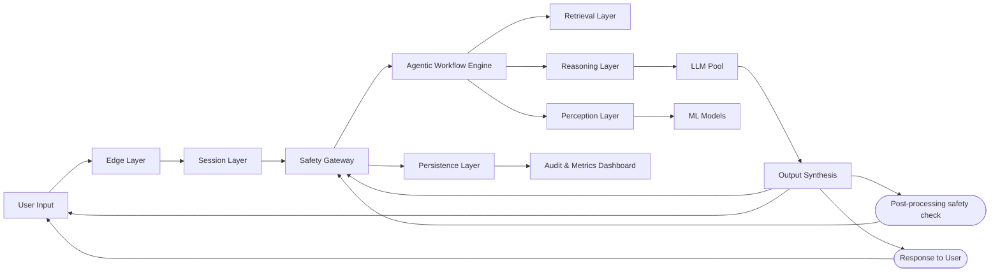

# Fairdoc AI Triage System Architecture Brief

## Overview

This document provides an updated architecture brief for the Fairdoc AI Triage System, incorporating insights from recent AI agent research[[1]](engineering.md) [[2]](brief.md) [[3]](solution.md). The focus is on creating a reliable, standards-compliant medical AI system that avoids common pitfalls of multi-agent designs while emphasizing context engineering for deterministic, traceable, and safe operations. This update addresses limitations in the initial implementation, such as hard-coded metrics, single-LLM dependency, and lack of standards integration (e.g., FHIR, NICE).

The architecture evolves the system into a modular, agentic framework with strong emphasis on reproducibility, safety, and scalability for mass public health applications (handling 5-6 crore users). It draws from Cognition AI's warnings against multi-agent complexity[[1]](engineering.md), Anthropic's effective agent building principles[[2]](brief.md), and OpenAI's practical guide to agent construction[[3]](solution.md), prioritizing sequential processing, shared context, and hierarchical decomposition over parallel multi-agent setups.

## Core Principles
The architecture is guided by these fundamental principles, derived from the research:

- **Context Engineering as Foundation**: All components share complete, immutable context to avoid fragmentation and conflicting assumptions[[1]](engineering.md)[[2]](brief.md).
- **Sequential Processing**: Use linear workflows to ensure actions build upon previous decisions, reducing errors from parallel execution[[1]](engineering.md)[[3]](solution.md).
- **Standards Compliance**: Integrate FHIR for interoperability and NICE guidelines for clinical decision-making[[4]](a-practical-guide-to-building-agents.pdf)[[5]](https://www.anthropic.com/engineering/building-effective-agents).
- **Deterministic Behavior**: Combine DSPy for programmable LLM control with LangChain for orchestration, ensuring reproducible outputs without relying on opaque prompts[[6]](https://cognition.ai/blog/dont-build-multi-agents).
- **Safety-First Design**: Implement multi-layer guardrails, evidence bundling, and human-in-loop triggers for high-stakes medical scenarios[[2]](brief.md)[[3]](solution.md).
- **Modularity for Scalability**: Components are LLM-agnostic, allowing easy switching between models (e.g., Deepseek-r1:8b, Mixtral, GPT-4o) while maintaining performance SLAs.

These principles ensure the system is not a "one-trick pony" but a general framework applicable to various medical tasks, from triage to report analysis.

## High-Level System Architecture

The system adopts a **context-engineered, sequential agentic workflow** with clear separation of concerns. It avoids multi-agent pitfalls by using a single orchestrator (Agentic Workflow Engine) that manages linear task decomposition with full context sharing.

---

---

### Component Descriptions

| Layer | Description | Key Technologies | Standards Integration | Expansion Path |
|-------|-------------|------------------|-----------------------|---------------|
| **Edge** | Handles multi-channel input/output (Raven-Chat, WhatsApp, Web) with initial validation. | FastAPI, Twilio | FHIR SMART for authentication | Add voice/video channels via WebRTC. |
| **Session** | Manages conversation state and user context with version control. | Redis, PostgreSQL | FHIR Patient/Encounter resources | Integrate long-term patient profiles from ERPNext. |
| **Safety Gateway** | Pre/post-processing guardrails for input/output validation. | DSPy Guardrails | NICE protocols, FHIR validation | Auto-optimize with gold medical datasets. |
| **Agentic Workflow Engine** | Orchestrates task decomposition and tool routing sequentially. | LangChain + DSPy | FHIR Parameters for structured data | Add hierarchical decomposition for complex triage. |
| **Retrieval** | Evidence-based knowledge retrieval from medical sources. | GraphRAG + ChromaDB | FHIR Resources, NICE APIs | Integrate PubMed and custom medical graphs. |
| **Reasoning** | Programmable LLM interactions with optimization. | DSPy Signatures | Structured outputs via DSPy | Multi-LLM routing with performance scoring. |
| **Perception** | Multimodal analysis (images, audio, reports). | Bio-ViT, Whisper | FHIR ImagingStudy, DICOM-SR | Add deterministic ML models for ECG/X-ray. |
| **LLM Pool** | Swappable LLMs with streaming support. | VLLM, Ollama | LLM-agnostic APIs | Dynamic routing based on cost/latency/safety. |
| **Persistence** | Immutable audit and metrics storage. | PostgreSQL, MinIO | FHIR Provenance | Versioned context with Git-like operations. |
| **Audit Dashboard** | Observability for safety and performance. | Kibana/Superset | FHIR-based queries | Real-time clinician review interface. |

## Detailed Component Specifications

### Edge Layer

- **Input Handling**: Stream inputs where possible (e.g., voice via WebSockets).
- **Output Streaming**: Supported LLM-agnostic via OpenAI-compatible APIs.
- **Expansion**: FHIR SMART for secure access to patient data.

### Session Layer (Context Engineering Core)

- **Git-in-Redis Implementation**: Use Redis hashes for content-addressed storage (as in Q2 solution).
- **Version Control Operations**: Commit, fork, merge, rollback for conversation states.
- **Context Summarization**: DSPy-based compression to prevent window saturation.

### Safety Gateway

- **Pre-Processing**: DSPy signatures to validate/optimize inputs.
- **Post-Processing**: Auto-check for hallucinations using optimized verifiers[[6]](https://cognition.ai/blog/dont-build-multi-agents).
- **NICE Integration**: Embed guidelines as DSPy demonstrations for auto-optimization.

### Agentic Workflow Engine

- **Sequential Decomposition**: Linear task chains with full context sharing[[1]](engineering.md).
- **Tool Routing**: DSPy for programmable control, LangChain for orchestration[[3]](solution.md).
- **Avoid Multi-Agent Pitfalls**: No parallel agents; hierarchical single-threaded flows.

### Retrieval Layer

- **GraphRAG**: Medical knowledge graphs from FHIR/NICE sources.
- **Evidence Bundling**: Generate FHIR Bundles for traceability.

### Reasoning Layer

- **DSPy Programs**: Signatures for structured medical reasoning (e.g., triage chains).
- **Optimization**: BootstrapFewShot with gold medical datasets for reproducibility[[6]](https://cognition.ai/blog/dont-build-multi-agents).

### Perception Layer

- **Multimodal Models**: Deterministic ML for images/audio, with FHIR output.
- **Traceability**: All predictions linked to FHIR Provenance.

### LLM Pool

- **Multi-LLM Support**: VLLM for high-throughput, Ollama for local dev.
- **Streaming**: Output streaming only; context engineering handles large inputs.

### Persistence Layer

- **Audit Trails**: FHIR Provenance for every decision point.
- **Metrics**: Non-hardcoded; DSPy-based reward functions for quality scoring.

    ----
