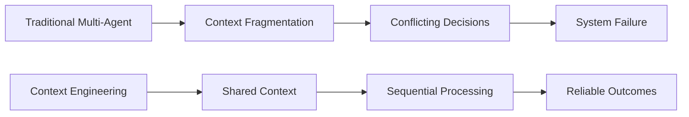
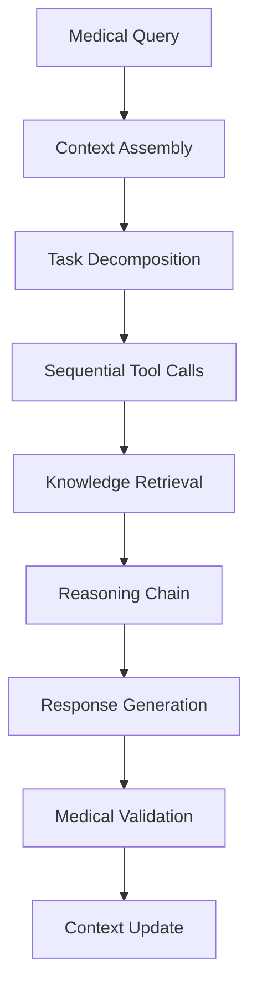
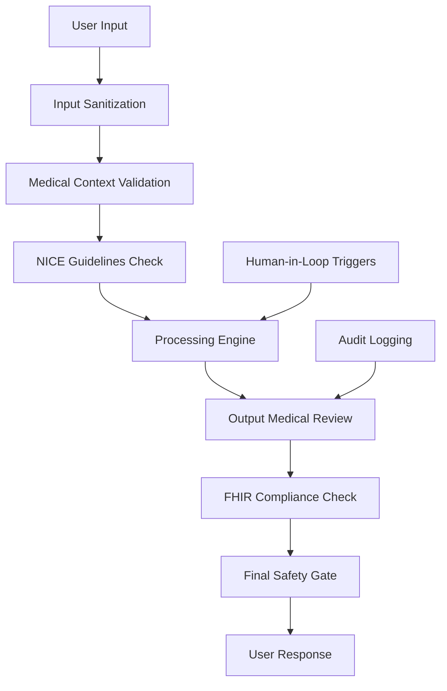
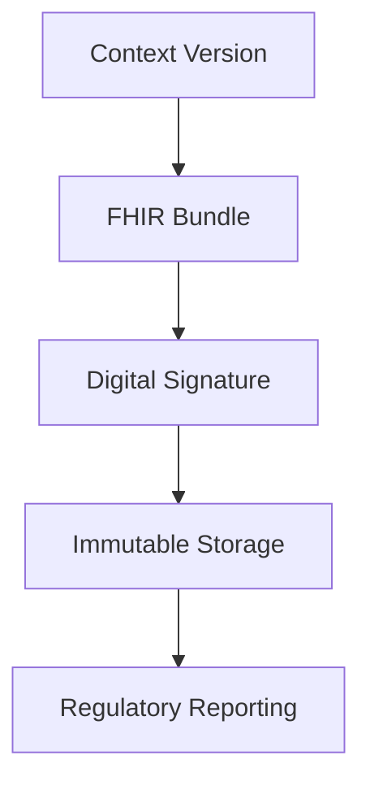

# Fairdoc AI Next-Generation Architecture Brief

## Executive Summary

This document outlines the next-generation architecture for Fairdoc AI, incorporating cutting-edge research from Cognition AI and Anthropic on effective agent design[[1]](https://cognition.ai/blog/dont-build-multi-agents), [[2]](https://www.anthropic.com/engineering/building-effective-agents). The architecture prioritizes **context engineering** as the foundational principle, avoiding multi-agent pitfalls while building a reliable, standards-compliant medical AI system.

Based on extensive research into LLM capabilities and limitations, this architecture addresses two critical technical constraints:
- **LLM Input Streaming**: Not supported in an LLM-agnostic way across major APIs
- **Context Window Management**: Solved through Redis-based version control system

The system is designed to handle 5-6 crore users with healthcare-grade reliability, transparency, and regulatory compliance.

## Core Architecture Philosophy

Following Cognition AI's principles [[1]](https://cognition.ai/blog/dont-build-multi-agents), we adopt **Context Engineering** as our foundational philosophy—the React moment for AI systems:



### Fundamental Principles

| Principle | Description | Healthcare Application |
|-----------|-------------|----------------------|
| **Context Continuity** | Every action informed by complete context history | Patient data, symptoms, and reasoning chain always preserved |
| **Sequential Processing** | Linear workflows, no parallel agent conflicts | Diagnostic steps build upon each other logically |
| **Actions Carry Decisions** | Every action contains embedded assumptions | Medical recommendations traceable to specific reasoning |
| **Immutable Context** | Version-controlled, git-like context management | Full audit trail for regulatory compliance |
| **Tool-First Design** | Agent-Computer Interface (ACI) as important as prompts | Medical tools optimized for LLM interaction |

## System Architecture Overview

The architecture follows Anthropic's building blocks approach [[2]](https://www.anthropic.com/engineering/building-effective-agents), progressing from simple augmented LLMs to sophisticated workflows:

```mermaid
graph TD
    A[User Input] --> B[Input Validation & Safety]
    B --> C[Context Version Control]
    C --> D[Orchestrator Engine]
    D --> E[Augmented LLM Pool]
    D --> F[Medical Knowledge Graph]
    D --> G[Specialized Tools]
    E --> H[Response Synthesis]
    F --> H
    G --> H
    H --> I[Safety Validation]
    I --> J[Context Commit]
    J --> K[User Response]
    
    L[Redis Context Store]  C
    M[FHIR Compliance Layer]  D
    N[Audit & Metrics]  J
```

## Component Architecture

### 1. Context Engineering Layer (Core Innovation)

**Redis-Based Version Control System**
```python
# Context versioning implementation
class MedicalContextVersionControl:
    def commit_context(self, context_data, parent_hash=None):
        context_hash = sha256(json.dumps(context_data, sort_keys=True)).hexdigest()
        
        self.redis.hset(f"ctx:{context_hash}", mapping={
            "data": json.dumps(context_data),
            "parent": parent_hash or "",
            "timestamp": datetime.utcnow().isoformat(),
            "fhir_bundle": self.generate_fhir_bundle(context_data),
            "medical_reasoning": context_data.get("reasoning_chain", "")
        })
        
        return context_hash
```

**Operations Available:**
- **Fork**: Create parallel diagnostic hypotheses
- **Merge**: Combine consultation threads  
- **Rollback**: Undo problematic context additions
- **Cherry-pick**: Apply specific medical insights
- **Compress**: Summarize long patient histories

### 2. Orchestrator Engine (Single-Threaded)

Following Cognition AI's recommendations [[1]](https://cognition.ai/blog/dont-build-multi-agents), we use a single orchestrator rather than multiple competing agents:



### 3. Workflow Patterns (Anthropic's Building Blocks)

| Pattern | Medical Use Case | Implementation |
|---------|------------------|----------------|
| **Prompt Chaining** | Symptom analysis → Differential diagnosis → Treatment plan | Sequential LLM calls with full context |
| **Routing** | Triage to appropriate medical specialty | Classification then specialized processing |
| **Sectioning** | Parallel safety checks while processing query | Independent guardrails without conflict |
| **Evaluator-Optimizer** | Medical recommendation review and refinement | Quality improvement through iteration |
| **Tool Integration** | Lab results, imaging analysis, drug interactions | Specialized medical APIs and databases |

### 4. Safety & Compliance Architecture

**Multi-Layer Safety System:**


## Technical Implementation Strategy

### LLM Integration (Addressing Q1 Limitation)

Since true input streaming is not supported across LLM APIs, we implement:

```python
class ContextAwareLLMInterface:
    def process_large_context(self, context_hash):
        # Retrieve and assemble context from Redis
        full_context = self.context_store.get_context_lineage(context_hash)
        
        # Smart compression if needed
        if len(full_context) > self.token_limit:
            compressed_context = self.compress_medical_context(full_context)
        else:
            compressed_context = full_context
            
        # Single LLM call with complete context
        response = self.llm_client.chat.completions.create(
            messages=compressed_context,
            stream=True  # Output streaming supported
        )
        
        return response
```

### Medical Knowledge Integration

**FHIR-Compliant Data Structures:**
```json
{
  "resourceType": "Bundle",
  "type": "batch",
  "entry": [
    {
      "resource": {
        "resourceType": "Patient",
        "id": "context-hash-123",
        "reasoning": "AI-generated diagnostic chain"
      }
    },
    {
      "resource": {
        "resourceType": "Provenance",
        "target": "context-hash-123",
        "agent": "fairdoc-ai-v2",
        "signature": "context-version-signature"
      }
    }
  ]
}
```

### Tool Engineering (Agent-Computer Interface)

Following Anthropic's guidance [[2]](https://www.anthropic.com/engineering/building-effective-agents), we prioritize tool design:

**Medical Tool Example:**
```python
class SymptomAnalyzer:
    """
    Analyzes patient symptoms using evidence-based medicine.
    
    Args:
        symptoms: List of symptoms in natural language
        patient_history: Previous medical context (from Redis)
        
    Returns:
        differential_diagnosis: Ranked list with confidence scores
        evidence_bundle: FHIR-compliant evidence references
    """
    
    def analyze(self, symptoms, patient_history=None):
        # Tool implementation optimized for LLM interaction
        pass
```

## Scalability & Performance

### Horizontal Scaling Strategy

| Component | Scaling Method | Target Capacity |
|-----------|----------------|-----------------|
| **Context Store** | Redis Cluster | 50M+ active contexts |
| **LLM Pool** | Load-balanced instances | 10K+ concurrent requests |
| **Knowledge Graph** | Distributed graph DB | 100M+ medical entities |
| **Safety Validators** | Parallel processing | Sub-100ms validation |

### Performance Targets

- **Response Latency**:



## Migration Strategy

### Phase 1: Context Engine (Weeks 1-2)

- Implement Redis-based context versioning
- Basic Git-like operations (commit, fork, merge)
- Integration with existing Fairdoc infrastructure

### Phase 2: Orchestrator Replacement (Weeks 3-4)

- Replace multi-agent setup with single orchestrator
- Implement Anthropic's workflow patterns
- Tool interface optimization

### Phase 3: Medical Optimization (Weeks 5-6)

- FHIR compliance layer
- Medical knowledge graph integration
- Regulatory audit features

### Phase 4: Scale Testing (Weeks 7-8)

- Load testing with 100K+ concurrent users
- Performance optimization
- Production deployment

## Monitoring & Observability

### Key Metrics Dashboard

- Context compression ratios
- Response accuracy vs. human physicians
- FHIR compliance rates
- Safety trigger frequencies
- User satisfaction scores

### Real-time Monitoring

- LLM response quality
- Context store performance
- Safety system effectiveness
- Regulatory compliance status

## Conclusion

This next-generation architecture represents a fundamental shift from multi-agent complexity to context-engineered simplicity. By embracing the principles from Cognition AI and Anthropic, we build a medical AI system that is:

- **Reliable**: No context fragmentation or conflicting decisions
- **Transparent**: Full audit trails and reasoning chains
- **Scalable**: Redis-based context management for millions of users
- **Compliant**: FHIR integration and regulatory requirements
- **Maintainable**: Simple, composable patterns over complex frameworks

The architecture solves the core technical challenges (LLM streaming limitations, context window management) while providing a foundation for safe, effective medical AI at scale.

**References:**

[1] [Cognition AI. "Don't Build Multi-Agents.](https://cognition.ai/blog/dont-build-multi-agents)

[2] [Anthropic. "Building Effective AI Agents.](https://www.anthropic.com/engineering/building-effective-agents)
