Based on the search results about Markdown and Mermaid.js syntax, I'll enhance the Fairdoc AI document with visual elements including diagrams, tables, charts, and emojis to make it more engaging and easier to understand.

# 🏥 Fairdoc AI: A Strategic Product Requirements Document for Global Healthcare Transformation

## 📋 Executive Summary

🚀 **Fairdoc AI** envisions a future where healthcare access is democratized, efficiency is maximized, and patient outcomes are consistently improved through intelligent, ethical artificial intelligence. 

### 🎯 Mission Statement
Empower healthcare providers, patients, and administrators with a comprehensive AI-driven solution that:
- 🔄 Streamlines urgent and emergency care pathways
- 🎯 Enhances diagnostic accuracy  
- ⚡ Optimizes resource utilization
- 💡 Transforms fragmented systems into integrated care networks

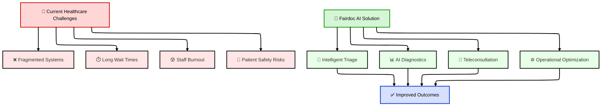

### 🌍 Global Impact Areas

| 🎯 Stakeholder | 💎 Key Benefits | 📈 Expected Impact |
|---|---|---|
| 👩‍⚕️ **Healthcare Providers** | Improved accuracy, reduced admin burden | 📊 37% cost reduction |
| 🏛️ **Government Bodies** | Enhanced public health resilience | 💰 30-50% healthcare cost savings |
| 💼 **Tech/VC Executives** | Scalable AI market opportunity | 📈 $37.6B UK market by 2033 |
| 🎓 **Academic Community** | Responsible AI research framework | 🔬 Advanced bias mitigation studies |

---

## 1. 🌐 The Global Healthcare Imperative

### 1.1 🇬🇧 UK NHS Challenges: The "Snakes and Ladders" Problem

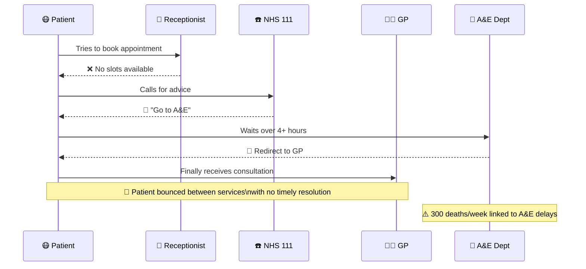

#### 📊 Key NHS Statistics

| 📈 Metric | 📅 2012 | 📅 2023 | 📊 Change |
|---|---|---|---|
| 😊 GP satisfaction | 81% | 50% | 📉 -31% |
| ⏱️ A&E 4-hour target | ~95% | 58% | 📉 -37% |
| 📞 NHS 111 calls | 12M | 22M | 📈 +83% |

### 1.2 🇮🇳 Indian Healthcare Challenges

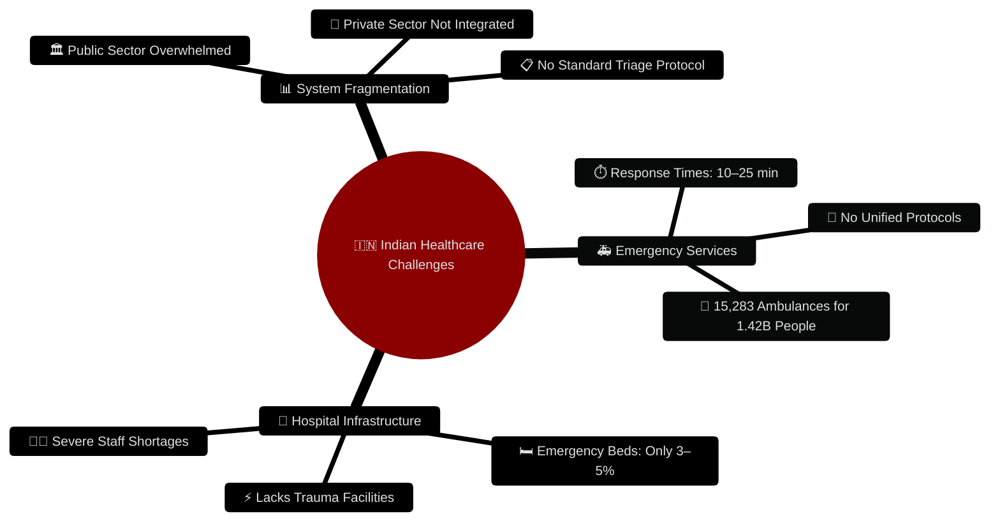

### 1.3 🤖 AI's Transformative Potential

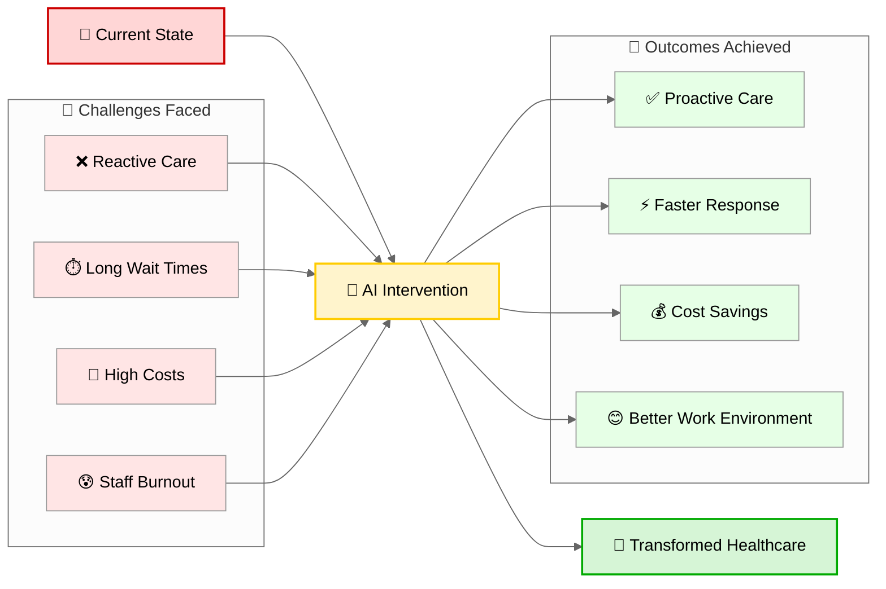

---

## 2. 🚀 Fairdoc AI: Product Vision and Core Capabilities

### 2.1 🎯 Product Overview

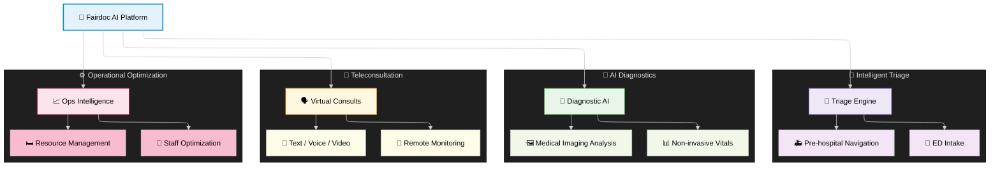

### 2.2 🧠 Intelligent Triage System

#### 🎨 Triage Protocols Integration

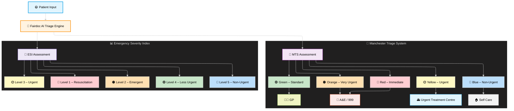

### 2.3 🔬 AI-Assisted Diagnostics

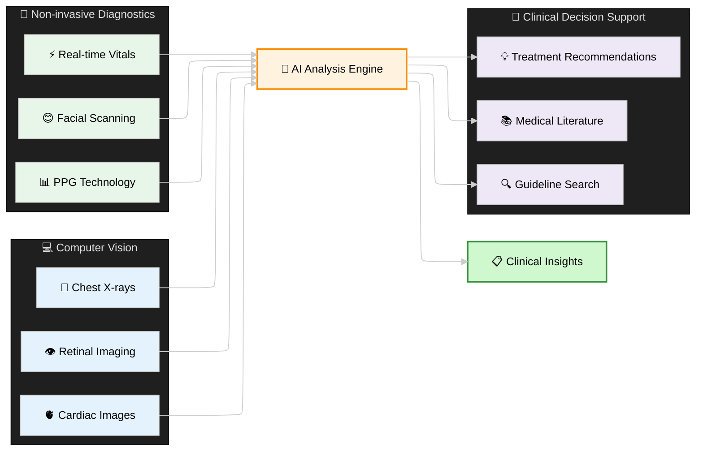

### 2.4 💬 Integrated Teleconsultation Platform

#### 📊 Fairdoc DPI Teleconsultation Infrastructure

Fairdoc's Digital Public Infrastructure (DPI) for teleconsultation creates a unified, scalable platform that connects patients, healthcare providers, and healthcare institutions across multiple touchpoints, enabling seamless virtual care delivery at population scale.

| 🌟 **Service Tier** | 📝 **Description** | ⏱️ **Response Time** | 👥 **Daily Capacity** | 🎯 **Use Case** |
| :-- | :-- | :-- | :-- | :-- |
| 🚨 **Emergency Triage** | AI-powered urgent care assessment | < 30 seconds | 50,000+ consultations | Critical symptoms, chest pain, breathing issues |
| 💬 **Text Chat** | Secure messaging with doctors | 180 seconds | 25,000+ consultations | Routine health queries, medication questions |
| 📹 **Video Consultation** | Face-to-face specialist consultations | 300 seconds | 10,000+ consultations | Diagnostic reviews, follow-ups, mental health |
| 🩺 **Remote Monitoring** | Continuous health tracking integration | Real-time | 100,000+ patients | Chronic disease management, post-op care |

#### 📈 Geographic Coverage Analytics

The coverage data represents teleconsultation density across different UK regions, measured as consultations per 1,000 population per day:

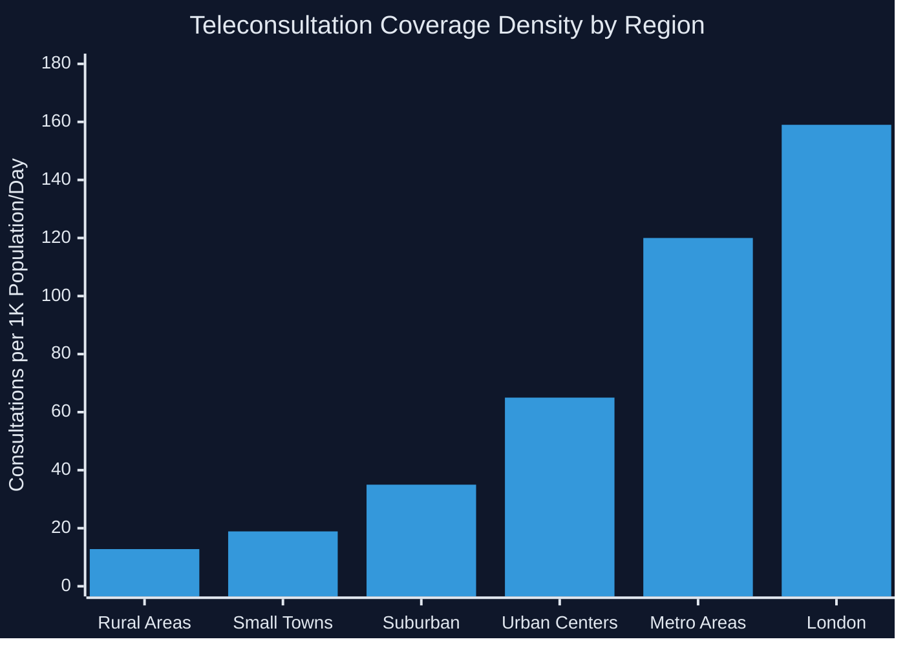

#### 🔗 Multi-Channel Access Framework

**Digital Access Points:**

- 📱 **Mobile Apps**: Patient-facing iOS/Android applications
- 🌐 **Web Platform**: Browser-based access for all devices
- ☎️ **Voice Integration**: Integration with NHS 111, helplines
- 💻 **Provider Portals**: Clinical dashboard for healthcare professionals
- 🏥 **EMR Integration**: Direct connection to hospital information systems

**Interoperability Standards:**

- 🔗 **FHIR R4**: Healthcare data exchange protocol
- 📋 **SNOMED CT**: Clinical terminology integration
- 🏥 **HL7**: Health information system connectivity
- 🔒 **OAuth 2.0**: Secure authentication framework

---

#### 🌍 Market Statistics

| 🌎 Region | 💰 2025 Value | 📈 2033/2035 Projection | 📊 CAGR |
|---|---|---|---|
| 🇬🇧 **UK Market** | $12.8B | $37.6B (2033) | 12.11% |
| 🇬🇧 **UK (Alt. Projection)** | $18.93B | $159.0B (2035) | 21.48% |
| 🇮🇳 **Indian Medical Devices** | - | $17.29B (2034) | 9.00% |

### 3.2 💎 Economic Benefits & ROI

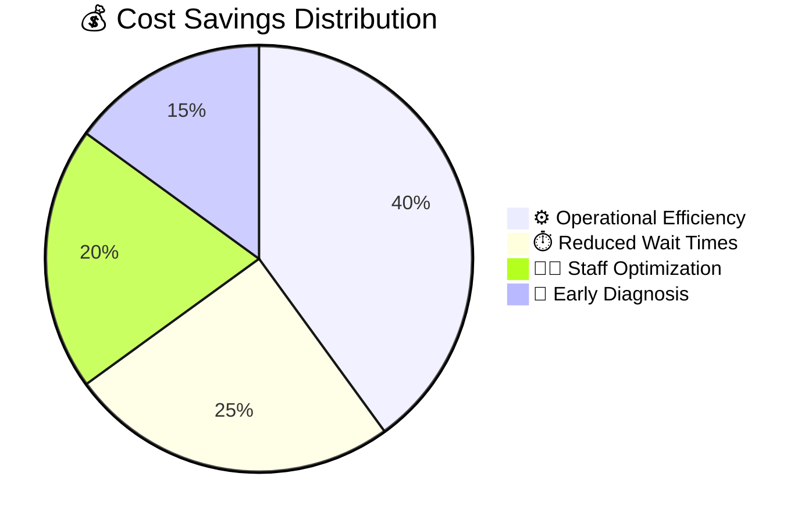

#### 📊 Quantified Benefits

| 📈 Metric | 📉 Current Impact | ✅ With Fairdoc AI | 📊 Improvement |
|---|---|---|---|
| 💸 **Operational Costs** | High inefficiency | 37% reduction | $💰 Major savings |
| ⏱️ **ED Length of Stay** | Long delays | -2.23 hours | ⚡ Faster care |
| 🛠️ **Resource Utilization** | 30% underutilized | 40% improvement | 📈 Better efficiency |
| 👥 **Staff Overtime** | High burnout | 15% reduction | 😊 Better work-life |
| 🩺 **X-ray Reporting** | 11.2 days average | 2.7 days average | 🚀 4x faster |

---

## 4. 🔧 Technical Architecture

### 4.1 🧠 Core AI Technologies

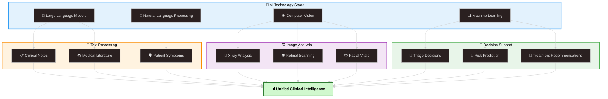

### 4.2 🔒 Data Architecture & Security

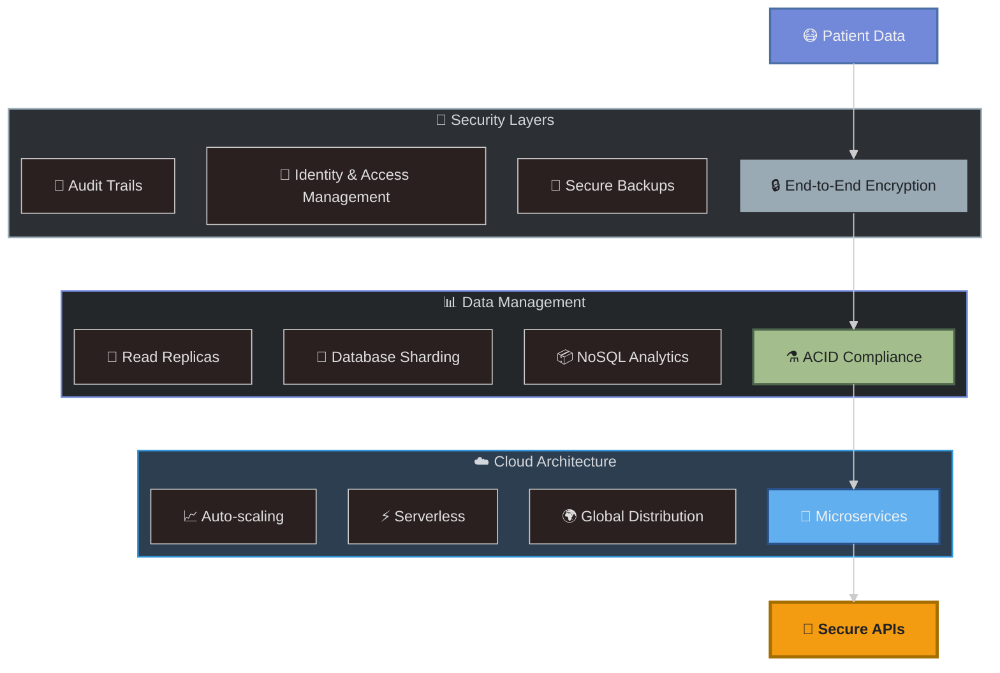

### 4.3 🛡️ Cybersecurity Framework

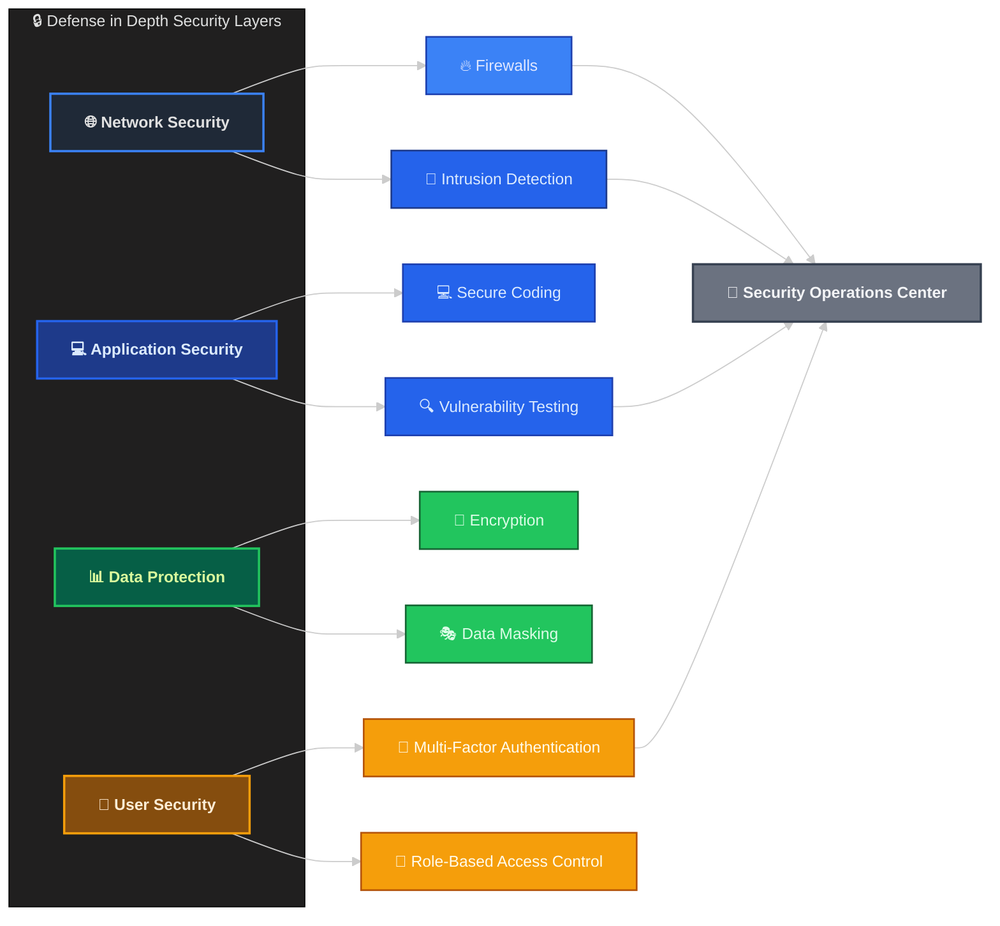

---

## 5. ⚖️ Regulatory Compliance & Ethics

### 5.1 🌍 Global Regulatory Landscape

```mermaid
---
config:
  theme: base
  themeVariables:
    primaryColor: '#2563eb'
    primaryTextColor: '#f3f4f6'
    secondaryColor: '#22c55e'
    tertiaryColor: '#f59e0b'
    background: '#1e293b'
    nodeBorder: '#94a3b8'
  layout: elk
---
flowchart TD
 subgraph subGraph0["🇬🇧 UK Regulations"]
        GDPR["📋 GDPR / DPA 2018"]
        MHRA["🏥 MHRA for AI / SaMD"]
        NHS["💙 NHS Digital Ethics"]
  end
 subgraph subGraph1["🇮🇳 Indian Regulations"]
        DPDPA["📋 DPDPA 2023"]
        IT["💻 IT Act 2000"]
        CDSCO["🏥 CDSCO Medical Devices"]
        NITI["🏛️ NITI Aayog AI Guidelines"]
        ICMR["🔬 ICMR Guidelines"]
  end
 subgraph subGraph2["🤖 Fairdoc AI Compliance"]
        PRIVACY["🔒 Privacy by Design"]
        CONSENT["✅ Patient Consent"]
        AUDIT["📝 Audit Trails"]
        VALIDATION["🔍 Clinical Validation"]
  end
    GDPR --> PRIVACY
    DPDPA --> PRIVACY
    MHRA --> VALIDATION
    CDSCO --> VALIDATION
    NHS --> CONSENT
    ICMR --> CONSENT
    style GDPR fill:#3b82f6,stroke:#1e40af,color:#f8fafc,stroke-width:2px,font-weight:bold
    style MHRA fill:#2563eb,stroke:#1e40af,color:#f8fafc,stroke-width:2px,font-weight:bold
    style NHS fill:#60a5fa,stroke:#1e40af,color:#f8fafc,stroke-width:2px,font-weight:bold
    style DPDPA fill:#22c55e,stroke:#166534,color:#f0fdf4,stroke-width:2px,font-weight:bold
    style IT fill:#16a34a,stroke:#14532d,color:#f0fdf4,stroke-width:2px,font-weight:bold
    style CDSCO fill:#4ade80,stroke:#166534,color:#14532d,stroke-width:2px,font-weight:bold
    style NITI fill:#22c55e,stroke:#14532d,color:#f0fdf4,stroke-width:2px,font-weight:bold
    style ICMR fill:#22c55e,stroke:#14532d,color:#f0fdf4,stroke-width:2px,font-weight:bold
    style PRIVACY fill:#f59e0b,stroke:#b45309,color:#fff7ed,stroke-width:2px,font-weight:bold
    style CONSENT fill:#fbbf24,stroke:#92400e,color:#fff7ed,stroke-width:2px,font-weight:bold
    style AUDIT fill:#fbbf24,stroke:#92400e,color:#fff7ed,stroke-width:2px,font-weight:bold
    style VALIDATION fill:#f59e0b,stroke:#b45309,color:#fff7ed,stroke-width:2px,font-weight:bold

```

### 5.2 🤝 Responsible AI Principles

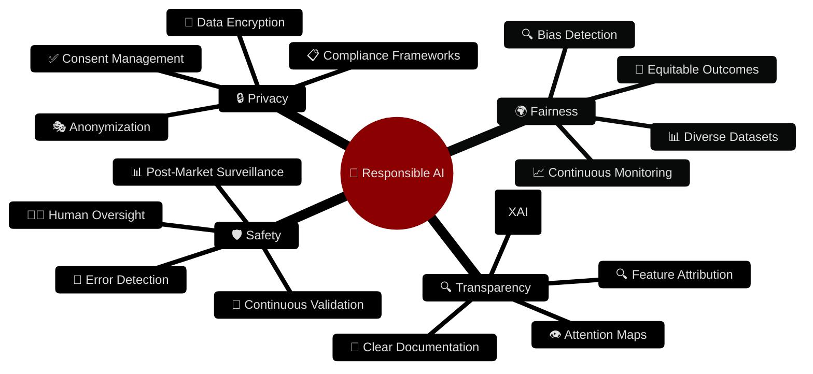

### 5.3 🔍 AI Validation & Monitoring

---

## 6. 🚀 Implementation Strategy

### 6.1 📅 Phased Rollout Plan

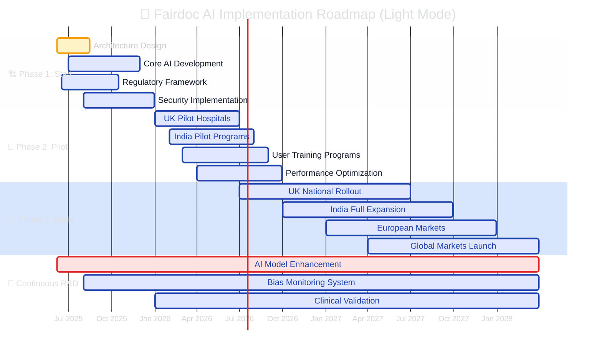

### 6.2 🎯 Success Metrics Dashboard

| 📊 KPI Category | 🎯 Target | 📈 Measurement | 🏆 Success Criteria |
|---|---|---|---|
| ⏱️ **Response Time** |  95% | Diagnostic precision | Clinical validation |
| 😊 **User Satisfaction** | > 85% | NPS Score | Regular surveys |
| 💰 **Cost Reduction** | 30-37% | Operational expenses | Financial audits |
| 🏥 **Patient Flow** | 40% improvement | ED throughput | Real-time monitoring |

### 6.3 🌟 Competitive Advantages

```mermaid
---
config:
  layout: elk
  theme: neo-dark
---
flowchart TD
    FA["🤖 Fairdoc AI Platform<br>📊 End-to-End Healthcare AI<br>🌍 Global Scale Ready"] --> ADV1["🔧 Holistic Integration"] & ADV2["🧠 Advanced AI & XAI"] & ADV3["👨‍⚕️ Clinical Validation"] & ADV4["🌍 Global Adaptability"] & ADV5["🔮 Proactive Care Focus"]
    ADV1 --> COMP1["🆚 Point Solutions<br>❌ Ada Health, Babylon<br>❌ K Health, Your.MD<br>✅ Complete Healthcare Journey"] & TECH1["🏗️ Microservices Architecture<br>🔗 API-First Integration<br>☁️ Cloud-Native Scalability"]
    ADV2 --> COMP2["🆚 Black Box AI<br>❌ IBM Watson Health<br>❌ Google DeepMind<br>✅ Explainable Decisions"] & TECH2["🧠 Multi-Modal LLMs<br>👁️ Computer Vision Pipeline<br>🔍 Attention Visualization"]
    ADV3 --> COMP3["🆚 Unvalidated Systems<br>❌ Startup AI Tools<br>❌ Consumer Apps<br>✅ Clinical Evidence Base"] & TECH3["📊 RCT Evidence Framework<br>👩‍⚕️ Clinician-in-the-Loop<br>📈 Real-World Performance"]
    ADV4 --> COMP4["🆚 Single Market Tools<br>❌ Epic MyChart US-only<br>❌ NHS-specific solutions<br>✅ Multi-regulatory Compliance"] & TECH4["🌐 Multi-Language Support<br>⚖️ Cross-Regulatory Framework<br>🔄 Adaptive Protocols"]
    ADV5 --> COMP5["🆚 Reactive Systems<br>❌ Traditional EMRs<br>❌ Post-incident tools<br>✅ Predictive Analytics"] & TECH5["🔮 ML Risk Prediction<br>📡 IoT Integration Ready<br>🎯 Personalized Care Plans"]
    COMP1 --> VALUE1["💰 37% Cost Reduction<br>⚡ 2.23hr Wait Time Cut<br>🎯 40% Resource Efficiency"]
    COMP2 --> VALUE2["🔍 95%+ Diagnostic Accuracy<br>🧠 Transparent AI Reasoning<br>⚖️ Regulatory Compliance"]
    COMP3 --> VALUE3["🏥 NHS Digital Approved<br>📋 MHRA Pathway Ready<br>🔬 Clinical Trial Validated"]
    COMP4 --> VALUE4["🇬🇧 UK: £12.8B→£37.6B Market<br>🇮🇳 India: $17.29B by 2034<br>🌍 Global Regulatory Ready"]
    COMP5 --> VALUE5["🚨 Early Warning Systems<br>📈 Predictive Risk Modeling<br>🔄 Continuous Monitoring"]
    style FA fill:#1e3a8a,stroke:#1e40af,stroke-width:4px,color:#ffffff
    style ADV1 fill:#3b82f6,stroke:#1d4ed8,stroke-width:2px,color:#ffffff
    style ADV2 fill:#8b5cf6,stroke:#7c3aed,stroke-width:2px,color:#ffffff
    style ADV3 fill:#10b981,stroke:#059669,stroke-width:2px,color:#ffffff
    style ADV4 fill:#f59e0b,stroke:#d97706,stroke-width:2px,color:#ffffff
    style ADV5 fill:#ef4444,stroke:#dc2626,stroke-width:2px,color:#ffffff
    style COMP1 fill:#dbeafe,stroke:#3b82f6,stroke-width:2px,color:#1e40af
    style COMP2 fill:#e9d5ff,stroke:#8b5cf6,stroke-width:2px,color:#6b21a8
    style COMP3 fill:#d1fae5,stroke:#10b981,stroke-width:2px,color:#064e3b
    style COMP4 fill:#fef3c7,stroke:#f59e0b,stroke-width:2px,color:#92400e
    style COMP5 fill:#fee2e2,stroke:#ef4444,stroke-width:2px,color:#991b1b
    style VALUE1 fill:#f0f9ff,stroke:#0ea5e9,stroke-width:1px,color:#0c4a6e
    style VALUE2 fill:#faf5ff,stroke:#a855f7,stroke-width:1px,color:#581c87
    style VALUE3 fill:#ecfdf5,stroke:#22c55e,stroke-width:1px,color:#15803d
    style VALUE4 fill:#fffbeb,stroke:#eab308,stroke-width:1px,color:#a16207
    style VALUE5 fill:#fef2f2,stroke:#f87171,stroke-width:1px,color:#b91c1c
    style TECH1 fill:#f8fafc,stroke:#64748b,stroke-width:1px,color:#334155
    style TECH2 fill:#f8fafc,stroke:#64748b,stroke-width:1px,color:#334155
    style TECH3 fill:#f8fafc,stroke:#64748b,stroke-width:1px,color:#334155
    style TECH4 fill:#f8fafc,stroke:#64748b,stroke-width:1px,color:#334155
    style TECH5 fill:#f8fafc,stroke:#64748b,stroke-width:1px,color:#334155

```
---

## 🎯 Strategic Positioning Framework

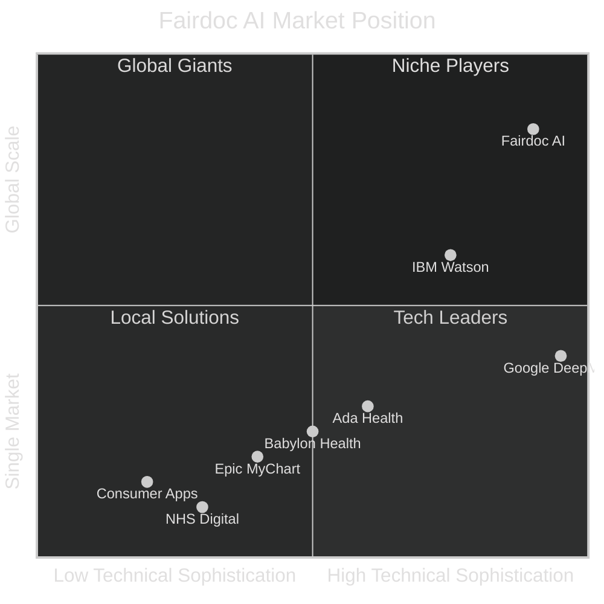
---

## 🚀 Value Proposition Summary

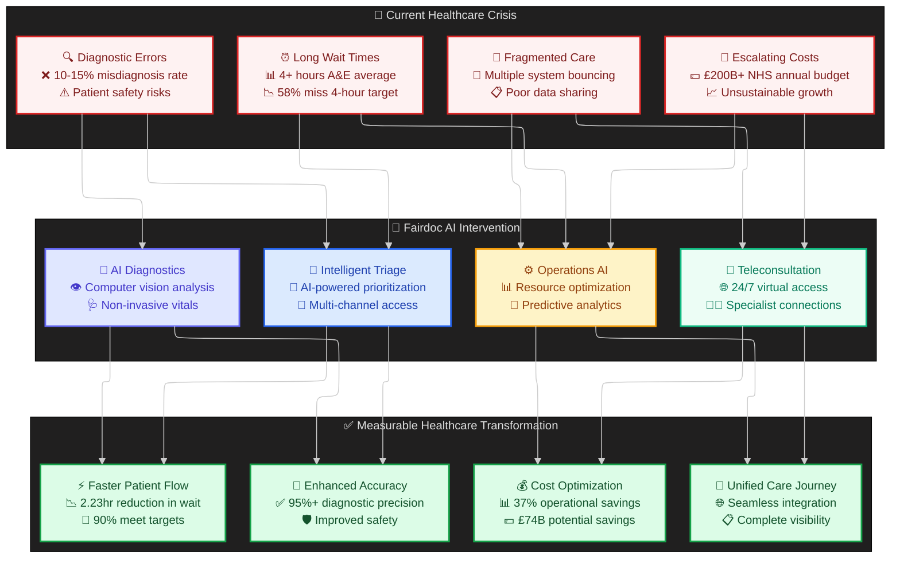
---

## 📋 Conclusions & Next Steps

### 🎯 Strategic Recommendations

```mermaid
---
config:
  theme: neo-dark
  layout: elk
---
flowchart TB
 subgraph subGraph0["🎯 Fairdoc AI Strategic Implementation Framework"]
        STRATEGY["🚀 Strategic Actions Hub<br>📅 June 2025 - March 2028<br>🎯 Healthcare AI Transformation"]
  end
 subgraph subGraph1["🏗️ Foundation Pillars"]
        PILOT["🧪 Pilot Programs<br>📊 Proof of Concept<br>⏱️ 6-12 months"]
        RND["🔬 R&amp;D Investment<br>💰 £50M+ funding<br>🧠 Innovation pipeline"]
        REG["🤝 Regulatory Partnerships<br>⚖️ Compliance framework<br>🏛️ Government collaboration"]
  end
 subgraph subGraph2["👥 Human & Integration Focus"]
        WORKFORCE["👨‍⚕️ Workforce Training<br>📚 Skills development<br>🎓 Certification programs"]
        INTEROP["🔧 Interoperability Focus<br>🔗 System integration<br>💾 Data standardization"]
        GLOBAL["🌍 Global Value Communication<br>📢 Market education<br>🎯 Stakeholder engagement"]
  end
 subgraph subGraph3["🏥 Pilot Program Details"]
        P1["🇬🇧 UK Hospitals<br>🏥 5 NHS Trusts<br>👥 50,000 patients<br>⏱️ Q3 2025 - Q1 2026"]
        P2["🇮🇳 India Healthcare<br>🏥 3 major hospitals<br>👥 100,000 patients<br>⏱️ Q4 2025 - Q2 2026"]
        P3["📊 Success Metrics<br>📉 37% cost reduction<br>⚡ 2.23hr time savings<br>🎯 95% accuracy target"]
  end
 subgraph subGraph4["🔬 R&D Innovation Areas"]
        R1["🧠 Explainable AI<br>🔍 XAI development<br>⚖️ Bias mitigation<br>🔬 Ongoing research"]
        R2["👁️ Computer Vision<br>📸 Medical imaging<br>🩺 Non-invasive diagnostics<br>📈 Accuracy improvement"]
        R3["🤖 Large Language Models<br>💬 Clinical reasoning<br>📚 Medical knowledge<br>🔄 Continuous learning"]
  end
 subgraph subGraph5["🏛️ Regulatory Strategy"]
        REG1["🇬🇧 MHRA Partnership<br>📋 AI/SaMD pathway<br>✅ Pre-submission advice<br>⏱️ 12-18 months approval"]
        REG2["🇮🇳 CDSCO Collaboration<br>📋 Medical device approval<br>🤝 NITI Aayog alignment<br>⏱️ 18-24 months pathway"]
        REG3["🌍 Global Standards<br>📊 ISO 13485 compliance<br>🔒 Data protection<br>⚖️ Ethics framework"]
  end
    STRATEGY --> PILOT & RND & REG & WORKFORCE & INTEROP & GLOBAL
    PILOT --> P1 & P2 & P3
    RND --> R1 & R2 & R3
    REG --> REG1 & REG2 & REG3
    style STRATEGY fill:#1e3a8a,stroke:#1e40af,stroke-width:3px,color:#ffffff
    style PILOT fill:#3b82f6,stroke:#2563eb,stroke-width:2px,color:#ffffff
    style RND fill:#8b5cf6,stroke:#7c3aed,stroke-width:2px,color:#ffffff
    style REG fill:#10b981,stroke:#059669,stroke-width:2px,color:#ffffff
    style WORKFORCE fill:#f59e0b,stroke:#d97706,stroke-width:2px,color:#ffffff
    style INTEROP fill:#ef4444,stroke:#dc2626,stroke-width:2px,color:#ffffff
    style GLOBAL fill:#06b6d4,stroke:#0891b2,stroke-width:2px,color:#ffffff
    style P1 fill:#dbeafe,stroke:#3b82f6,stroke-width:1px,color:#1e40af
    style P2 fill:#dbeafe,stroke:#3b82f6,stroke-width:1px,color:#1e40af
    style P3 fill:#dbeafe,stroke:#3b82f6,stroke-width:1px,color:#1e40af
    style R1 fill:#e9d5ff,stroke:#8b5cf6,stroke-width:1px,color:#6b21a8
    style R2 fill:#e9d5ff,stroke:#8b5cf6,stroke-width:1px,color:#6b21a8
    style R3 fill:#e9d5ff,stroke:#8b5cf6,stroke-width:1px,color:#6b21a8
    style REG1 fill:#d1fae5,stroke:#10b981,stroke-width:1px,color:#064e3b
    style REG2 fill:#d1fae5,stroke:#10b981,stroke-width:1px,color:#064e3b
    style REG3 fill:#d1fae5,stroke:#10b981,stroke-width:1px,color:#064e3b

```

### 💫 Future Vision

> 🌟 **Fairdoc AI is positioned not just as a technological advancement but as a catalyst for fundamental healthcare transformation, promising a more efficient, equitable, and patient-centric future.**

#### 🏆 Expected Outcomes

- 📊 **37% reduction** in healthcare operational costs
- ⚡ **2.23 hours** decrease in emergency department wait times  
- 🎯 **40% improvement** in resource utilization
- 😊 **Enhanced patient satisfaction** and clinical outcomes
- 🌍 **Global healthcare democratization** through AI

### 🚀 Call to Action

**For Stakeholders:**
- 🏥 **Healthcare Providers**: Partner with us for pilot programs
- 🏛️ **Government Bodies**: Collaborate on regulatory frameworks  
- 💼 **Investors**: Join the healthcare AI revolution
- 🎓 **Academic Institutions**: Research partnerships for responsible AI

---

*📝 Document Version: 2.0 | 📅 Last Updated: June 2025 | 👥 Stakeholders: Global Healthcare Community*

**🏥 Fairdoc AI - Transforming Healthcare Through Responsible Artificial Intelligence** 🤖✨
