Based on the search results about Markdown and Mermaid.js syntax, I'll enhance the Fairdoc AI document with visual elements including diagrams, tables, charts, and emojis to make it more engaging and easier to understand.

# 🏥 Fairdoc AI: A Strategic Product Requirements Document for Global Healthcare Transformation

## 📋 Executive Summary

🚀 **Fairdoc AI** envisions a future where healthcare access is democratized, efficiency is maximized, and patient outcomes are consistently improved through intelligent, ethical artificial intelligence. 

### 🎯 Mission Statement
Empower healthcare providers, patients, and administrators with a comprehensive AI-driven solution that:
- 🔄 Streamlines urgent and emergency care pathways
- 🎯 Enhances diagnostic accuracy  
- ⚡ Optimizes resource utilization
- 💡 Transforms fragmented systems into integrated care networks

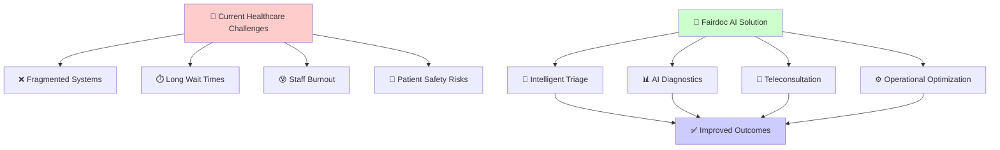

### 🌍 Global Impact Areas

| 🎯 Stakeholder | 💎 Key Benefits | 📈 Expected Impact |
|---|---|---|
| 👩‍⚕️ **Healthcare Providers** | Improved accuracy, reduced admin burden | 📊 37% cost reduction |
| 🏛️ **Government Bodies** | Enhanced public health resilience | 💰 30-50% healthcare cost savings |
| 💼 **Tech/VC Executives** | Scalable AI market opportunity | 📈 $37.6B UK market by 2033 |
| 🎓 **Academic Community** | Responsible AI research framework | 🔬 Advanced bias mitigation studies |

---

## 1. 🌐 The Global Healthcare Imperative

### 1.1 🇬🇧 UK NHS Challenges: The "Snakes and Ladders" Problem

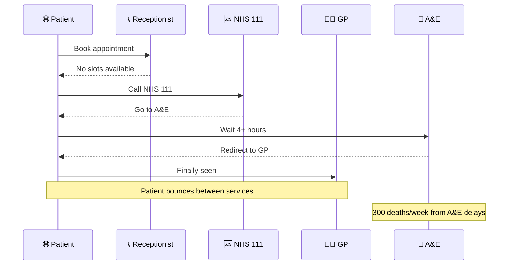

#### 📊 Key NHS Statistics

| 📈 Metric | 📅 2012 | 📅 2023 | 📊 Change |
|---|---|---|---|
| 😊 GP satisfaction | 81% | 50% | 📉 -31% |
| ⏱️ A&E 4-hour target | ~95% | 58% | 📉 -37% |
| 📞 NHS 111 calls | 12M | 22M | 📈 +83% |

### 1.2 🇮🇳 Indian Healthcare Challenges

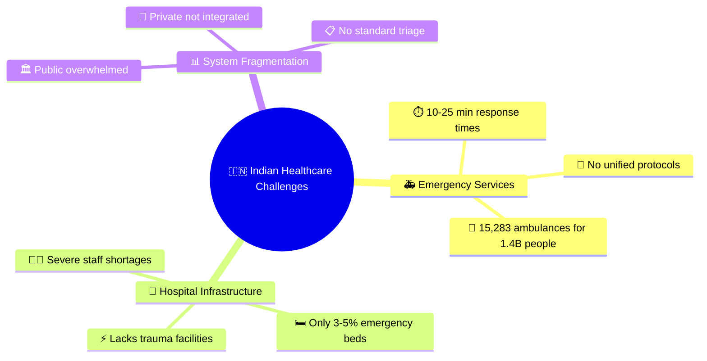

### 1.3 🤖 AI's Transformative Potential

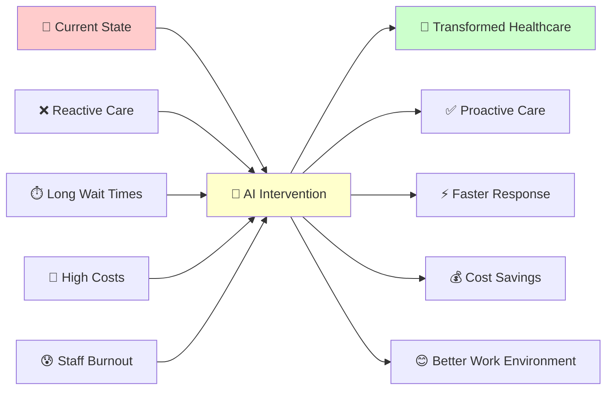

---

## 2. 🚀 Fairdoc AI: Product Vision and Core Capabilities

### 2.1 🎯 Product Overview

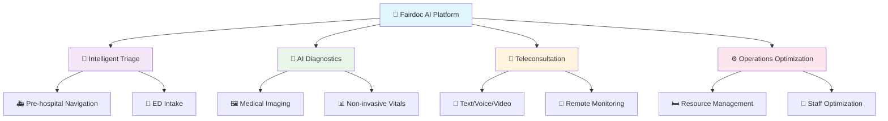

### 2.2 🧠 Intelligent Triage System

#### 🎨 Triage Protocols Integration

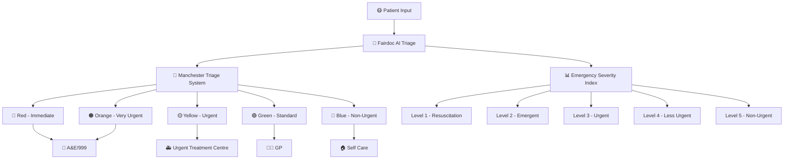

### 2.3 🔬 AI-Assisted Diagnostics

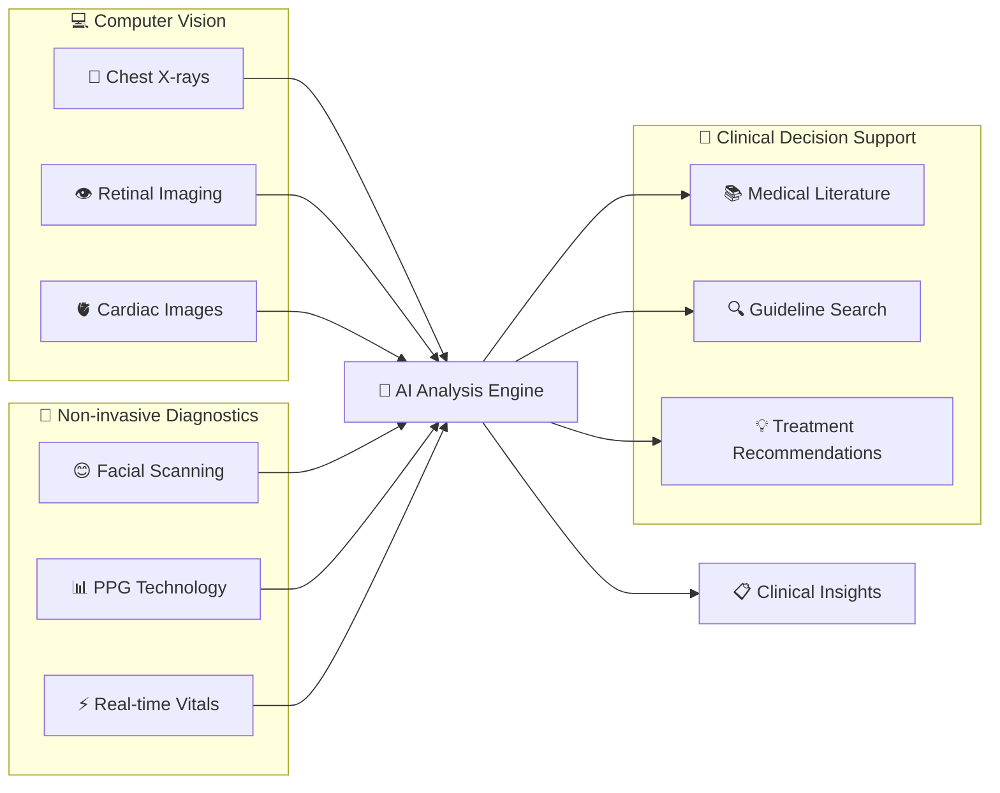

### 2.4 💬 Integrated Teleconsultation Platform

#### 📊 Teleconsultation Features

| 🌟 Feature | 📝 Description | ⏱️ Response Time | 👥 Coverage |
|---|---|---|---|
| 💬 **Text Chat** | Secure messaging with doctors |  180
    bar [12.8, 18.9, 35, 65, 120, 159]
```

#### 🌍 Market Statistics

| 🌎 Region | 💰 2024 Value | 📈 2033/2035 Projection | 📊 CAGR |
|---|---|---|---|
| 🇬🇧 **UK Market** | $12.8B | $37.6B (2033) | 12.11% |
| 🇬🇧 **UK (Alt. Projection)** | $18.93B | $159.0B (2035) | 21.48% |
| 🇮🇳 **Indian Medical Devices** | - | $17.29B (2034) | 9.00% |

### 3.2 💎 Economic Benefits & ROI

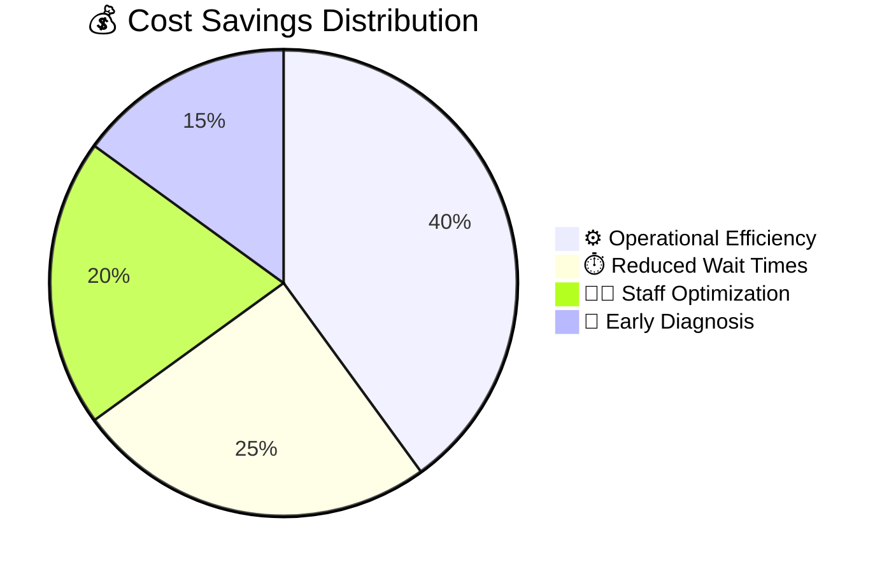

#### 📊 Quantified Benefits

| 📈 Metric | 📉 Current Impact | ✅ With Fairdoc AI | 📊 Improvement |
|---|---|---|---|
| 💸 **Operational Costs** | High inefficiency | 37% reduction | $💰 Major savings |
| ⏱️ **ED Length of Stay** | Long delays | -2.23 hours | ⚡ Faster care |
| 🛠️ **Resource Utilization** | 30% underutilized | 40% improvement | 📈 Better efficiency |
| 👥 **Staff Overtime** | High burnout | 15% reduction | 😊 Better work-life |
| 🩺 **X-ray Reporting** | 11.2 days average | 2.7 days average | 🚀 4x faster |

---

## 4. 🔧 Technical Architecture

### 4.1 🧠 Core AI Technologies

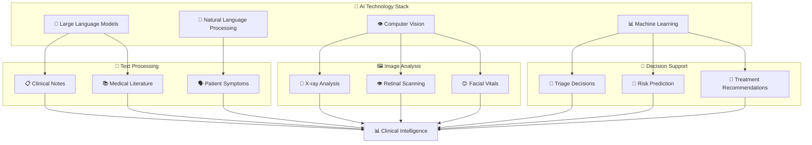

### 4.2 🔒 Data Architecture & Security

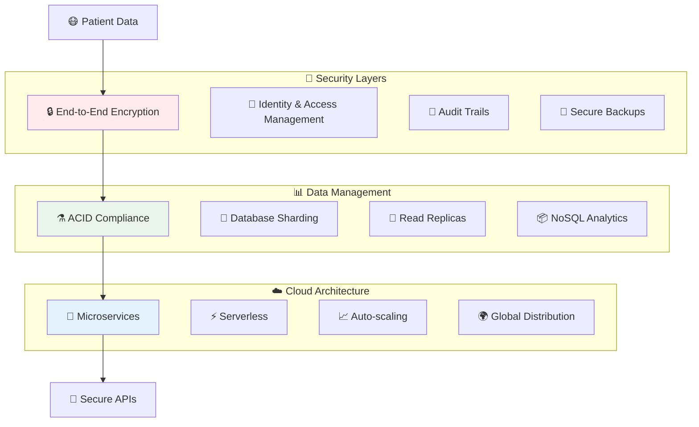

### 4.3 🛡️ Cybersecurity Framework

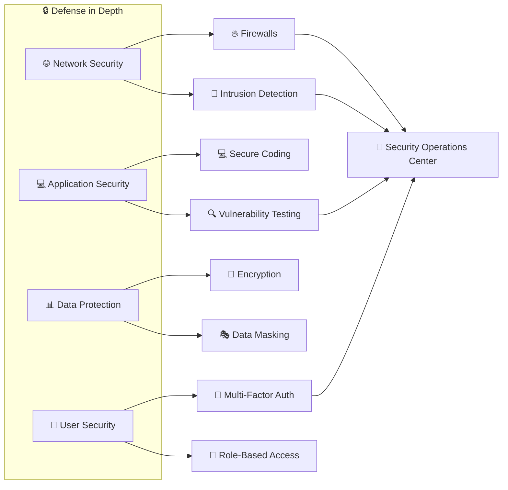

---

## 5. ⚖️ Regulatory Compliance & Ethics

### 5.1 🌍 Global Regulatory Landscape

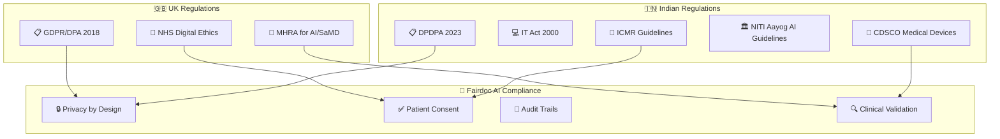

### 5.2 🤝 Responsible AI Principles

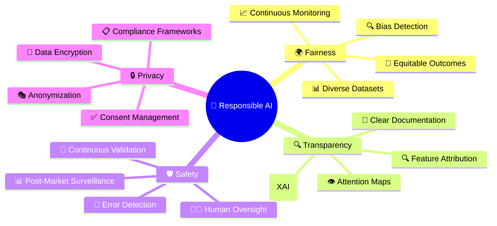

### 5.3 🔍 AI Validation & Monitoring

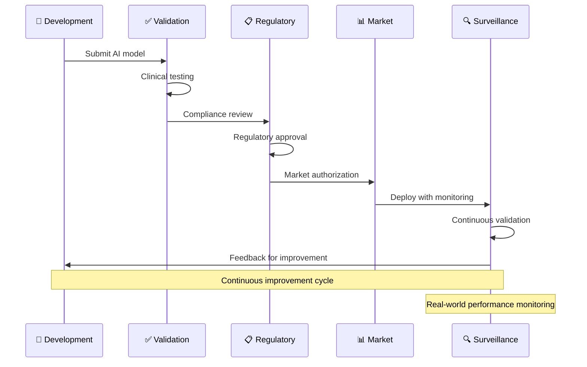

---

## 6. 🚀 Implementation Strategy

### 6.1 📅 Phased Rollout Plan

```mermaid
gantt
    title 🚀 Fairdoc AI Implementation Roadmap
    dateFormat  YYYY-MM-DD
    section 🏗️ Phase 1: Foundation
    Core AI development       :done, dev1, 2024-01-01, 2024-06-01
    Regulatory framework      :done, reg1, 2024-03-01, 2024-08-01
    Security implementation   :active, sec1, 2024-05-01, 2024-09-01
    
    section 🧪 Phase 2: Pilot
    UK pilot hospitals        :future, pilot1, 2024-07-01, 2024-12-01
    India pilot programs      :future, pilot2, 2024-09-01, 2025-02-01
    User training            :future, train1, 2024-10-01, 2025-01-01
    
    section 📈 Phase 3: Scale
    UK national rollout      :future, scale1, 2025-01-01, 2025-12-01
    India expansion          :future, scale2, 2025-03-01, 2026-03-01
    Global markets           :future, global, 2025-06-01, 2027-06-01
```

### 6.2 🎯 Success Metrics Dashboard

| 📊 KPI Category | 🎯 Target | 📈 Measurement | 🏆 Success Criteria |
|---|---|---|---|
| ⏱️ **Response Time** |  95% | Diagnostic precision | Clinical validation |
| 😊 **User Satisfaction** | > 85% | NPS Score | Regular surveys |
| 💰 **Cost Reduction** | 30-37% | Operational expenses | Financial audits |
| 🏥 **Patient Flow** | 40% improvement | ED throughput | Real-time monitoring |

### 6.3 🌟 Competitive Advantages

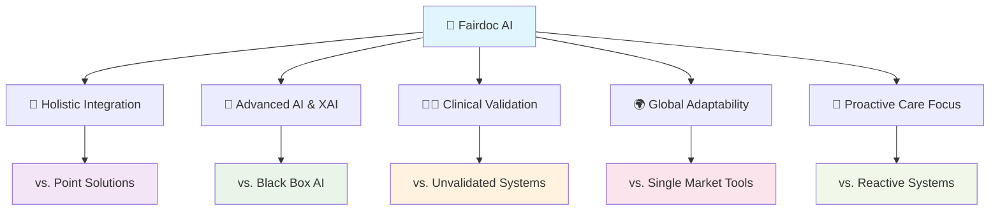

---

## 📋 Conclusions & Next Steps

### 🎯 Strategic Recommendations

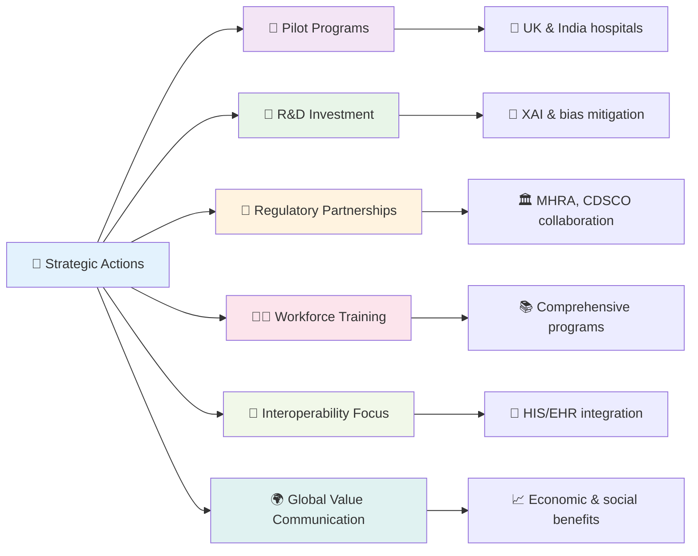

### 💫 Future Vision

> 🌟 **Fairdoc AI is positioned not just as a technological advancement but as a catalyst for fundamental healthcare transformation, promising a more efficient, equitable, and patient-centric future.**

#### 🏆 Expected Outcomes

- 📊 **37% reduction** in healthcare operational costs
- ⚡ **2.23 hours** decrease in emergency department wait times  
- 🎯 **40% improvement** in resource utilization
- 😊 **Enhanced patient satisfaction** and clinical outcomes
- 🌍 **Global healthcare democratization** through AI

### 🚀 Call to Action

**For Stakeholders:**
- 🏥 **Healthcare Providers**: Partner with us for pilot programs
- 🏛️ **Government Bodies**: Collaborate on regulatory frameworks  
- 💼 **Investors**: Join the healthcare AI revolution
- 🎓 **Academic Institutions**: Research partnerships for responsible AI

---

*📝 Document Version: 2.0 | 📅 Last Updated: June 2025 | 👥 Stakeholders: Global Healthcare Community*

**🏥 Fairdoc AI - Transforming Healthcare Through Responsible Artificial Intelligence** 🤖✨
